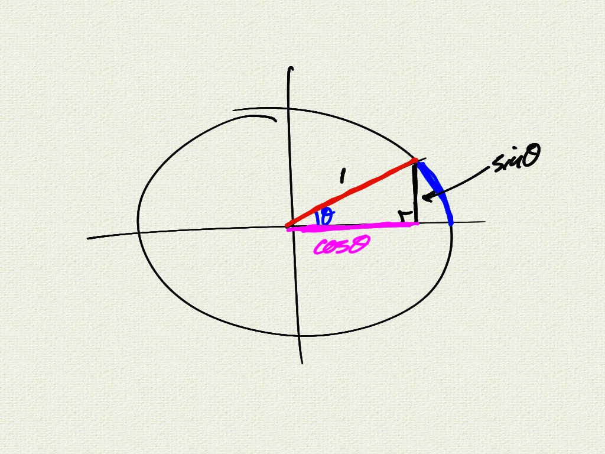

I'll be posting class notes and supplementary material for each lesson. 

Here's a warmup: what's going on in this interactive demo?

    

 

General sinusoid:
$$
    f(x) = a \sin(b(x-h)) + k
$$  

