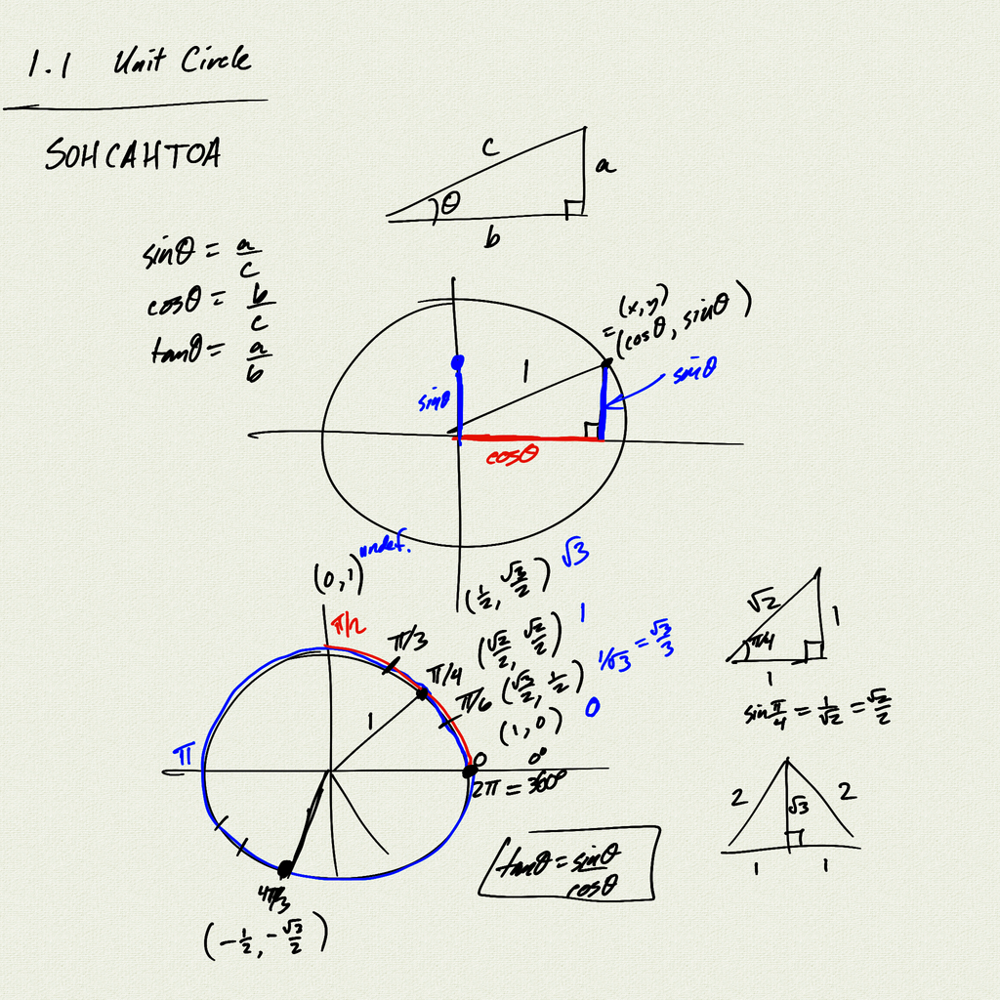
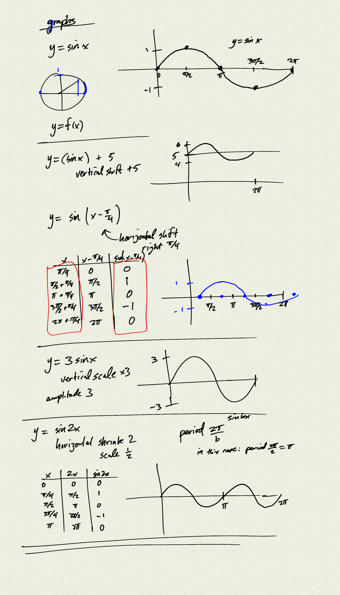
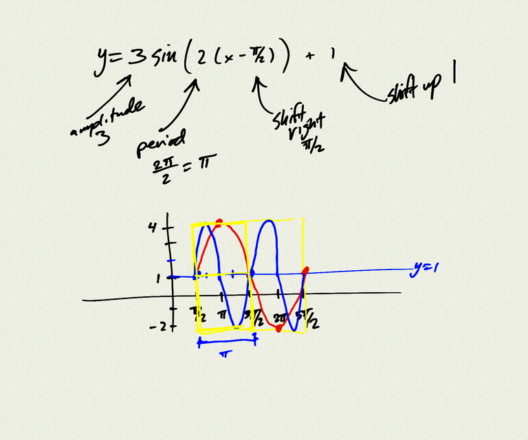
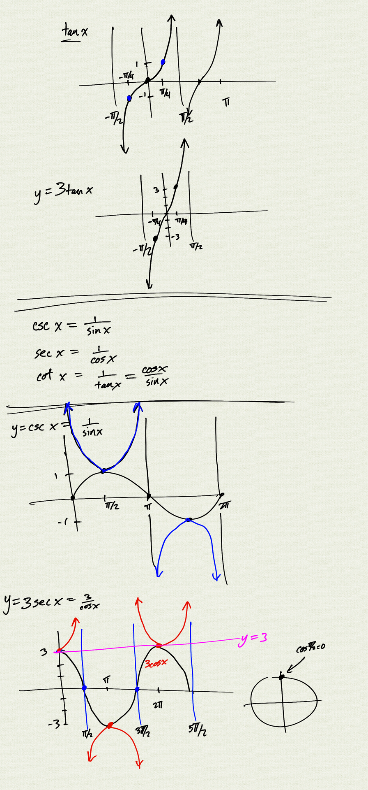
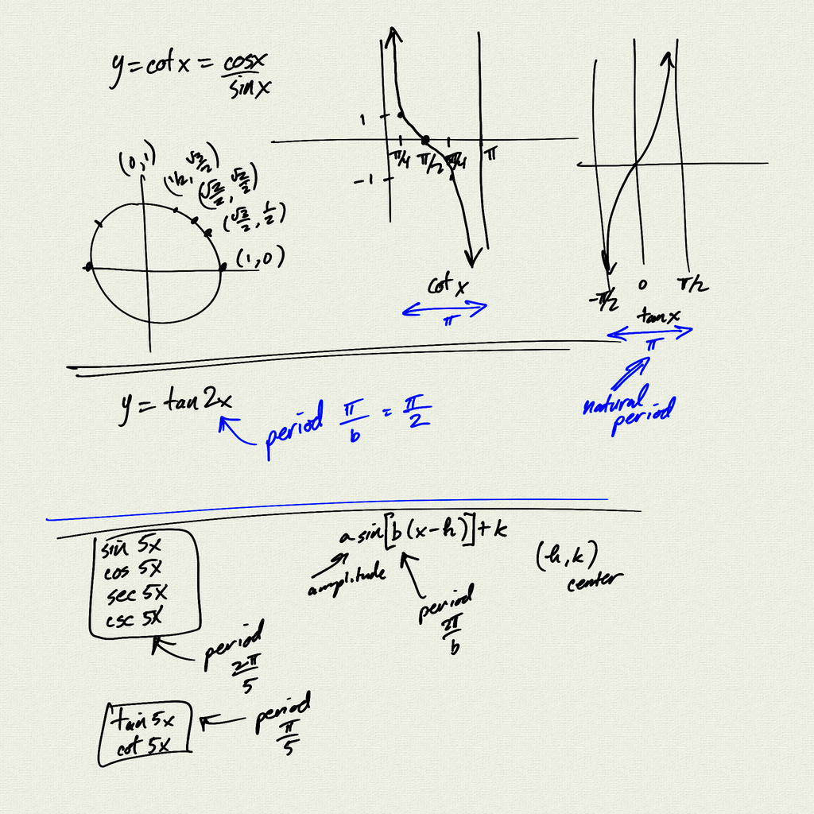

Here's a warmup: what's going on in this interactive demo?

    

 

<iframe class="video" src="https://www.youtube.com/embed/bKb0gtU4i9I" title="YouTube video player" frameborder="0" allow="accelerometer; autoplay; clipboard-write; encrypted-media; gyroscope; picture-in-picture" allowfullscreen></iframe>

[notes (pdf)](PCHA_1.1-1.2_UnitCircle_TrigGraphs.pdf)

