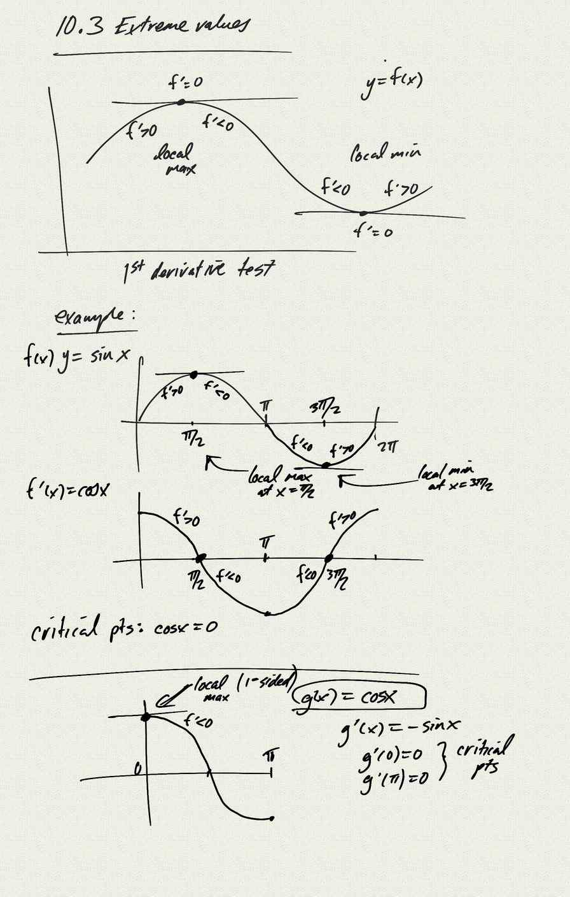
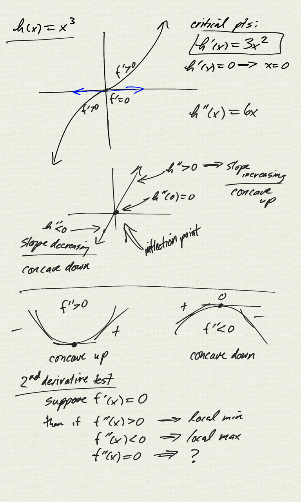
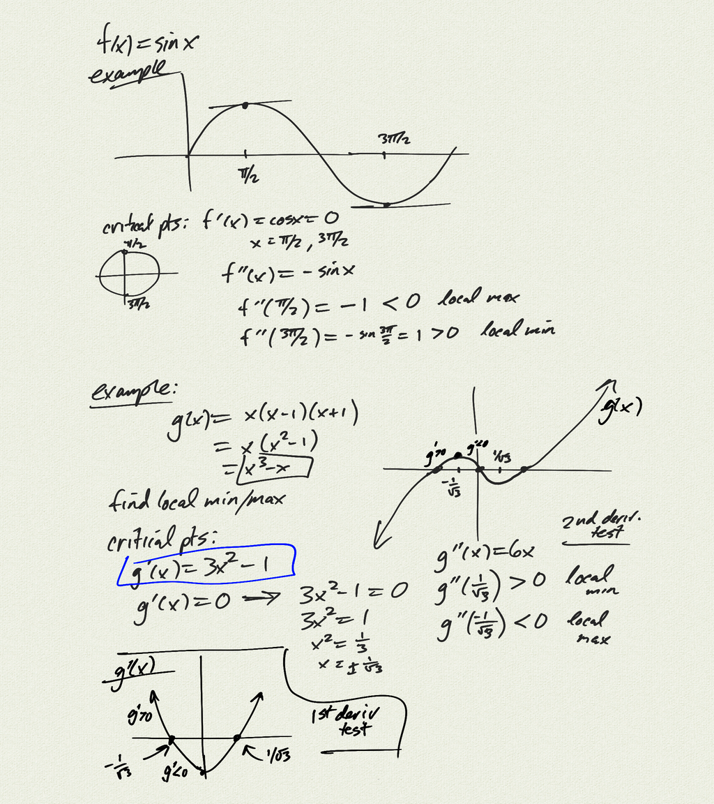
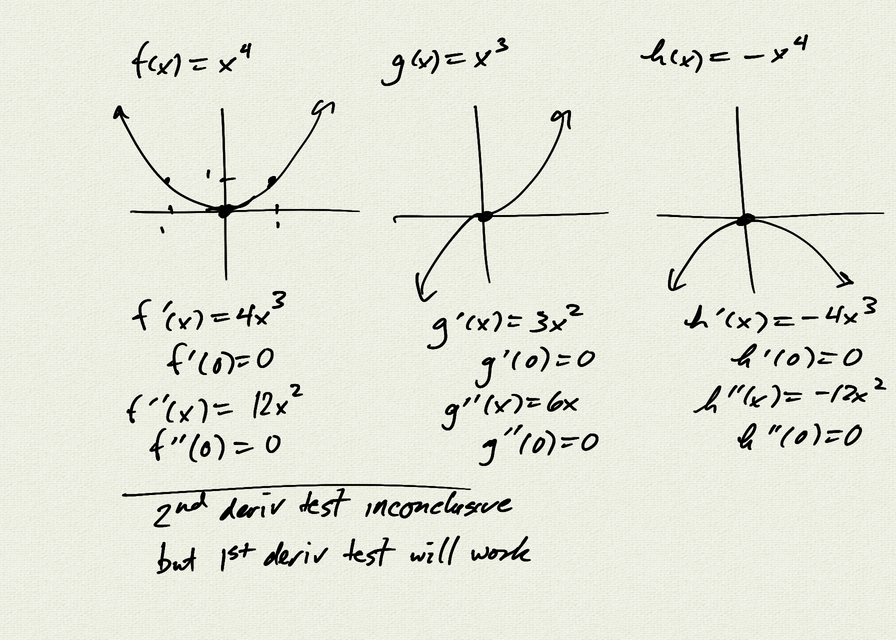

Topics: 

- 1st derivative test
- 2nd derivative test
- concave up/down
- inflection points

[notes (pdf)](PCHA_10.3_ExtremeValueTests.pdf)

<iframe width="560" height="315" src="https://www.youtube.com/embed/AM9cb5-LToE" title="YouTube video player" frameborder="0" allow="accelerometer; autoplay; clipboard-write; encrypted-media; gyroscope; picture-in-picture" allowfullscreen></iframe>

