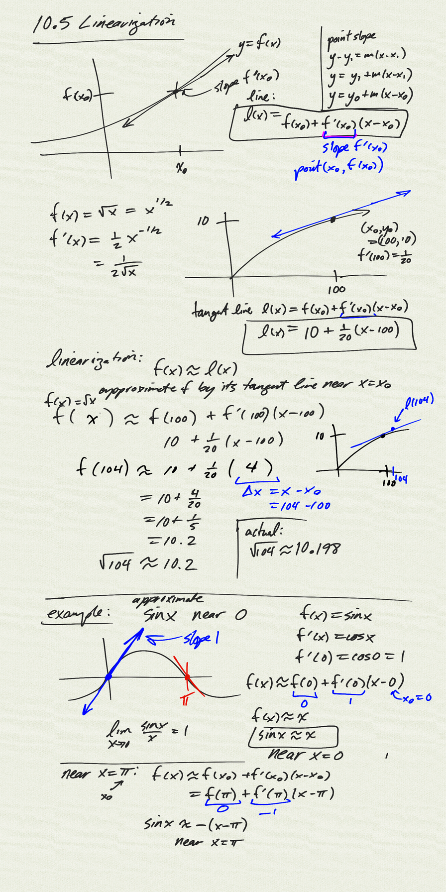
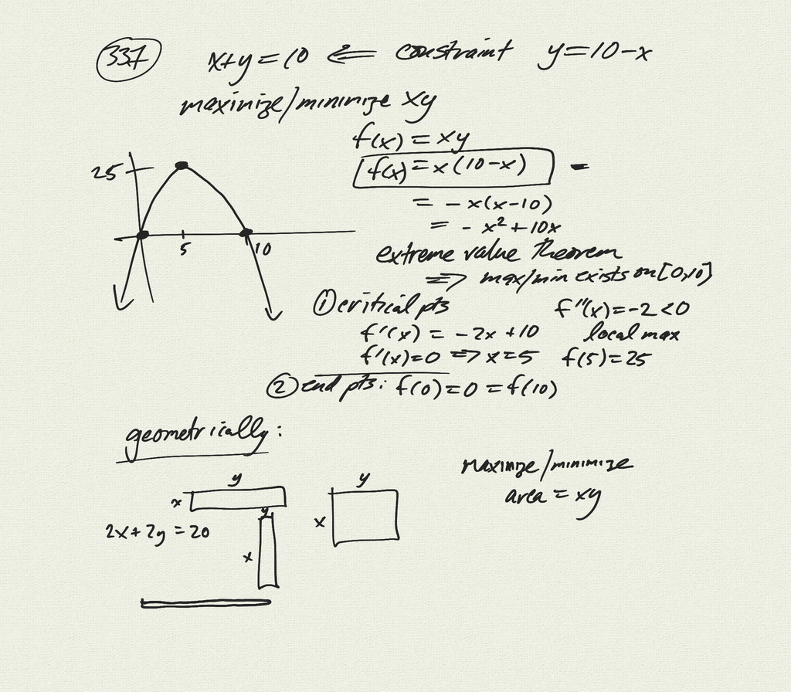

Topics: 

- approximating a function by its tangent line:
    $f(x) \approx f(x_0) + f'(x_0)(x-x_0)$

[notes (pdf)](PCHA_10.5_Linearization.pdf)

<iframe width="560" height="315" src="https://www.youtube.com/embed/WjrEA3ALP8I" title="YouTube video player" frameborder="0" allow="accelerometer; autoplay; clipboard-write; encrypted-media; gyroscope; picture-in-picture" allowfullscreen></iframe>

