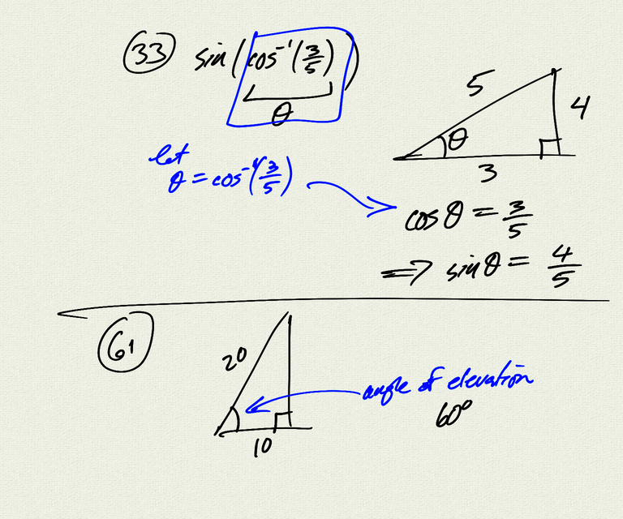

Topics: 
- Pythagorean identities
- cofactor identities
- odd/even identities
- sum/difference identities
- examples:
    - $\sin(x+\frac{\pi}{2}) = \cos x$
    - $-\tan(x-\frac{\pi}{2}) = \cot x$
    - $\frac{\cos x}{1-\sin x} = \sec x + \tan x$

Reference: [OSP 7.1, 7.2](https://openstax.org/books/precalculus/pages/7-1-solving-trigonometric-equations-with-identities)

<iframe class="video" src="https://www.youtube.com/embed/4CQTQNxkJcw" title="YouTube video player" frameborder="0" allow="accelerometer; autoplay; clipboard-write; encrypted-media; gyroscope; picture-in-picture" allowfullscreen></iframe>

[notes (pdf)](PCHA_2.1-2.2_TrigIdentities.pdf)

