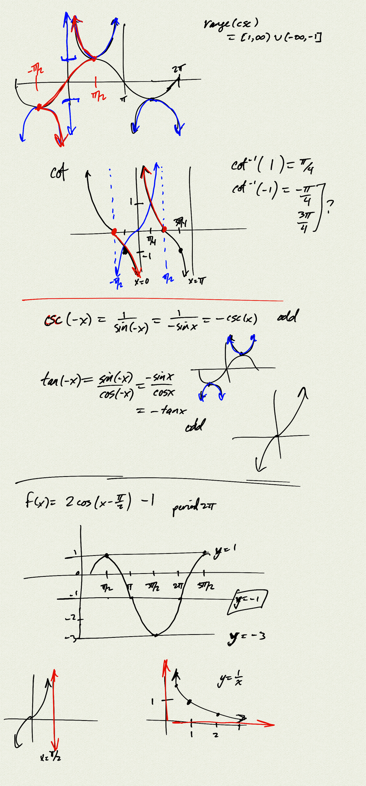
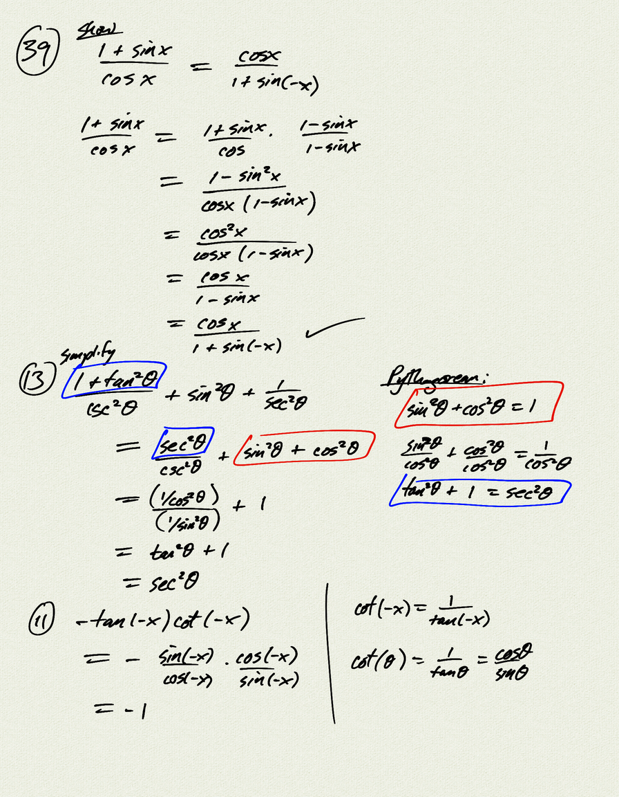
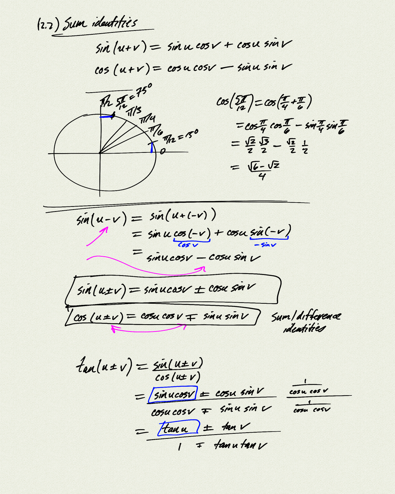
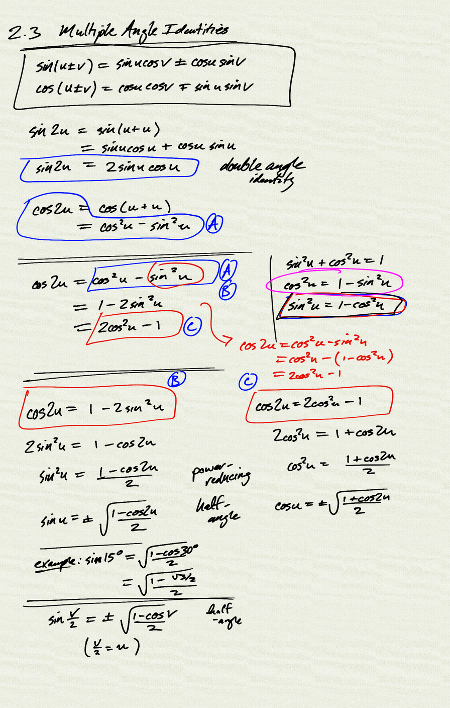
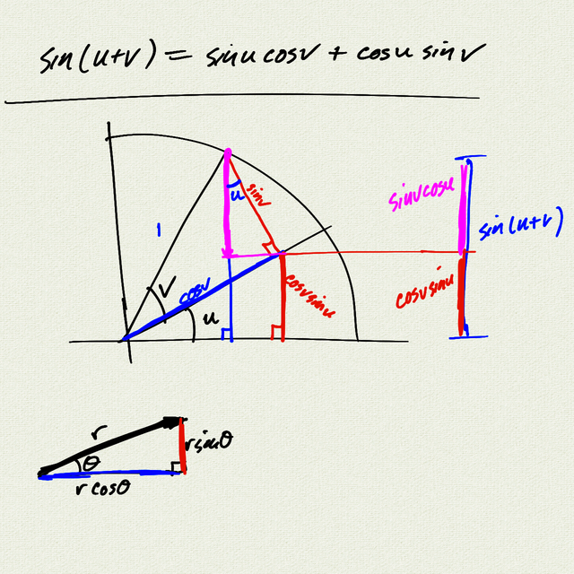

Topics: 
- double angle identities
- power-reducing identities
- half-angle identities

Reference: [OSP 7.3](https://openstax.org/books/precalculus/pages/7-3-double-angle-half-angle-and-reduction-formulas)

[notes (pdf)](PCHA_2.3_MultipleAngle.pdf)

<iframe class="video" src="https://www.youtube.com/embed/https://www.youtube.com/embed/4CQTQNxkJcw" title="YouTube video player" frameborder="0" allow="accelerometer; autoplay; clipboard-write; encrypted-media; gyroscope; picture-in-picture" allowfullscreen></iframe>
