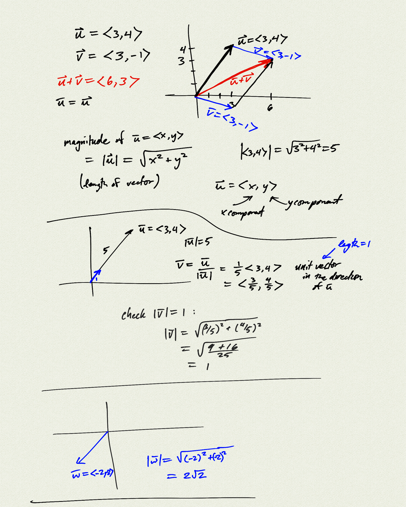
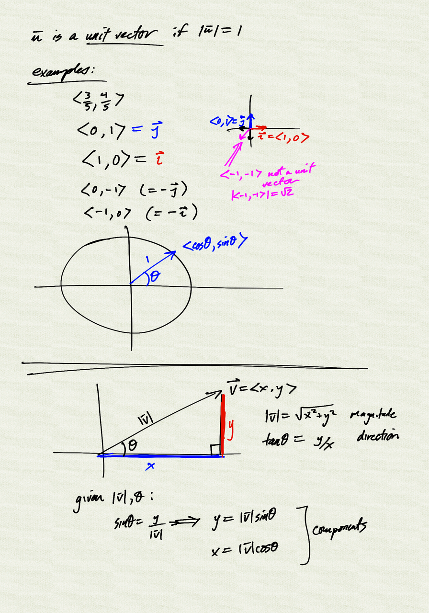
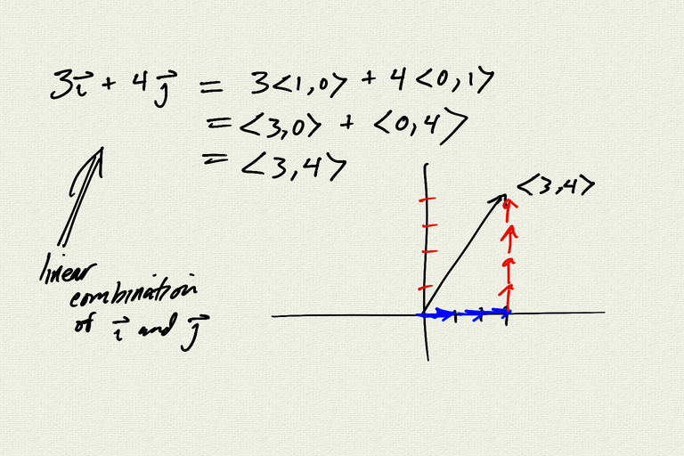
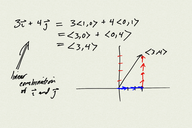

Topics: 
- Vectors
    - basic operations: addition and scalar multiplication
    - magnitude and direction
    - unit vectors, linear combinations
- Dot product
    - component definition
    - magnitude (as dot product)
    - unit vectors / projection on axes
    - law of cosines -> angle definition
    - orthogonality
    - angle between vectors

Reference: 
[OSP 8.8](https://openstax.org/books/precalculus/pages/8-8-vectors)

[notes (pdf)](PCHA_3.1_Vectors.pdf)

<iframe class="video" src="https://www.youtube.com/embed/80rR-CXvu3w" title="YouTube video player" frameborder="0" allow="accelerometer; autoplay; clipboard-write; encrypted-media; gyroscope; picture-in-picture" allowfullscreen></iframe>

