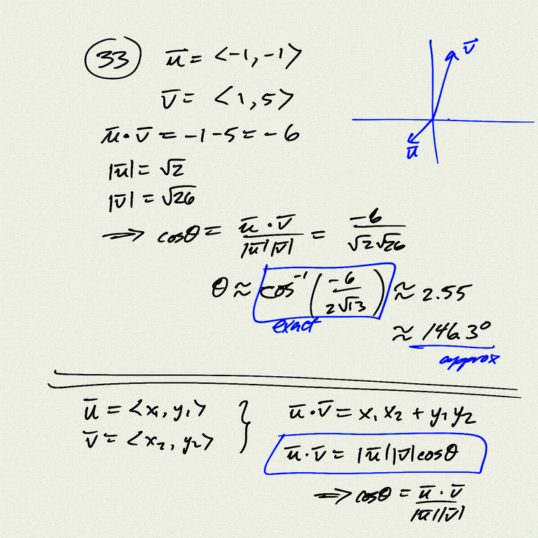
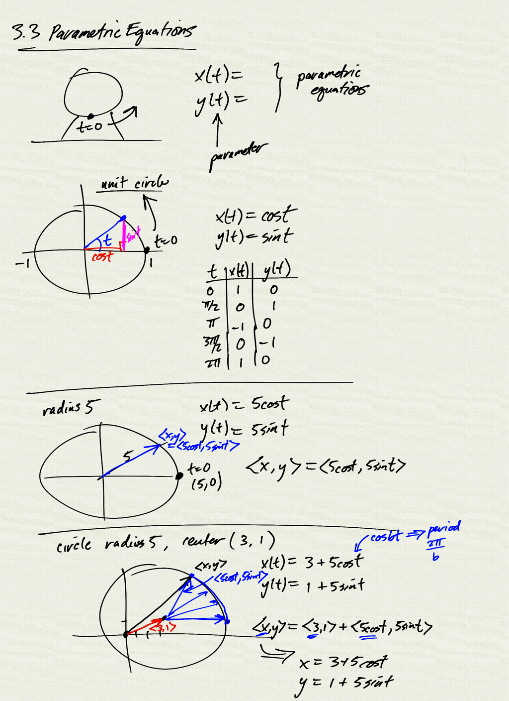
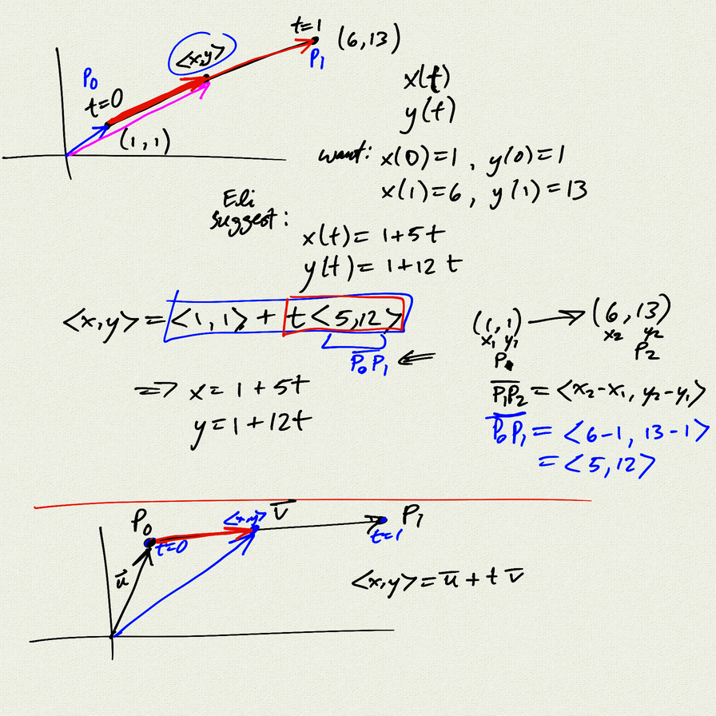
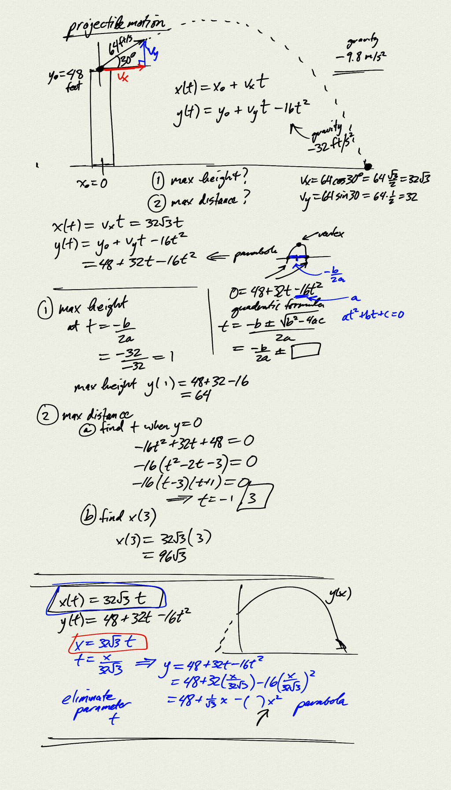
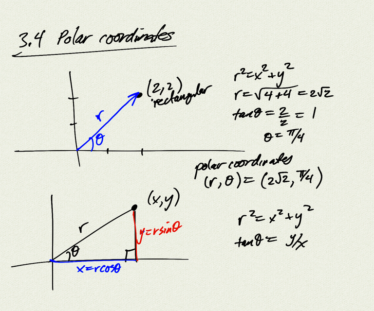
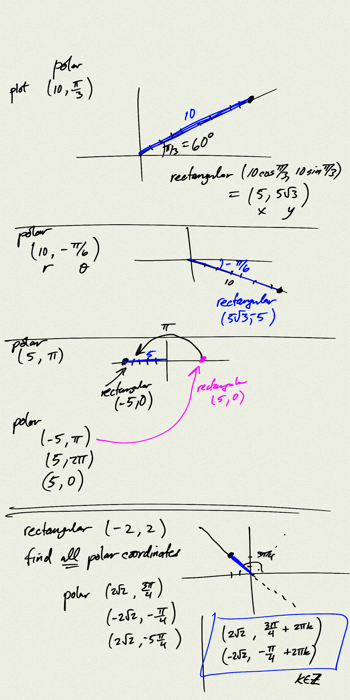

Topics: 

- Parametric equations
    - parametrizing a circle
    - parametrizing a line
    - projectile motion
    - eliminating the parameter
    - polar coordinates

Reference: 

[OSP 8.6](https://openstax.org/books/precalculus/pages/8-6-parametric-equations)  
[OSP 8.7](https://openstax.org/books/precalculus/pages/8-7-parametric-equations-graphs)  
[OSP 8.3](https://openstax.org/books/precalculus/pages/8-3-polar-coordinates)  

[notes (pdf)](PCHA_3.3_ParametricEquations.pdf)

<iframe class="video" src="https://www.youtube.com/embed/m3-Odj7wdv0" title="YouTube video player" frameborder="0" allow="accelerometer; autoplay; clipboard-write; encrypted-media; gyroscope; picture-in-picture" allowfullscreen></iframe>

