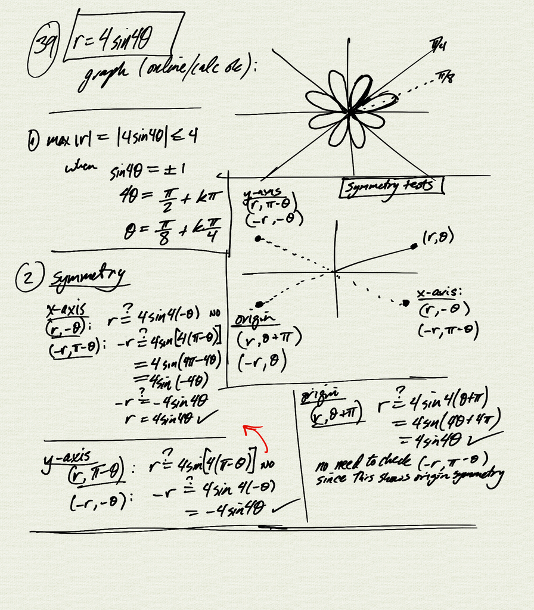

Polar graph analysis:
- graph (online/calculator ok)
- find max $\|r\|$ value and all $\theta$ where it occurs
- symmetry tests 
    - x-axis, y-axis, origin (rotation by $\pi$)
    - look at graph and verify any symmetries you see (this example has all
      three, but you only need to check the ones you see on the graph)

Reference:
[OSP 8.4](https://openstax.org/books/precalculus/pages/8-4-polar-coordinates-graphs)  

[example (pdf)](example.pdf)

