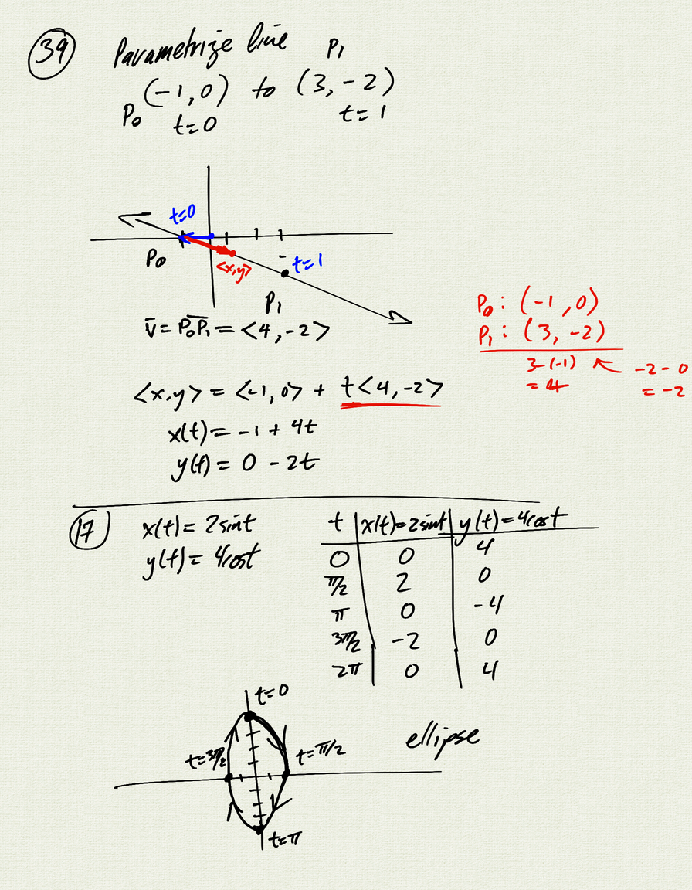
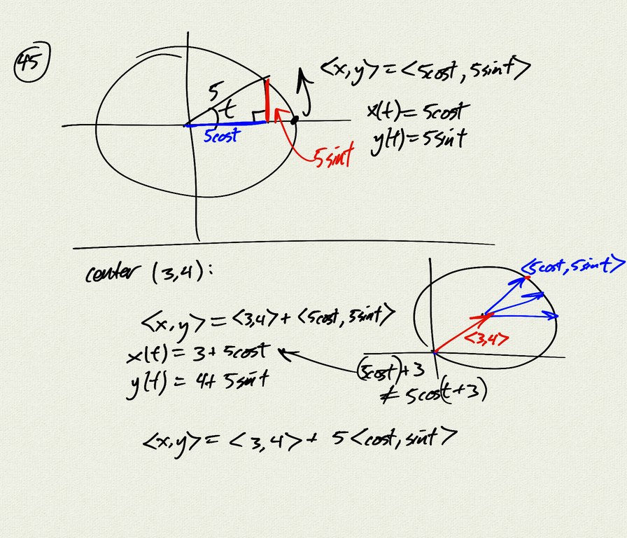
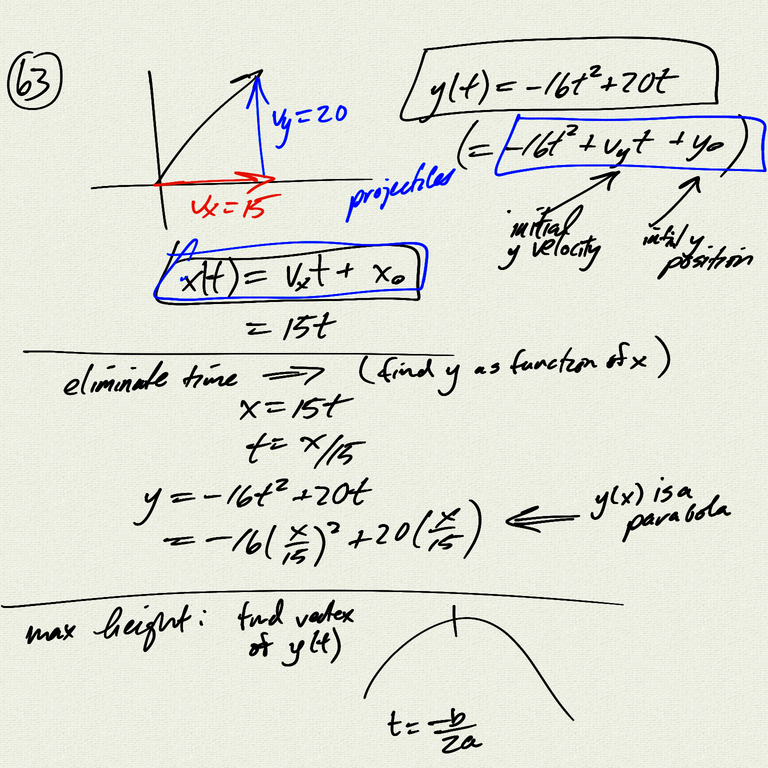
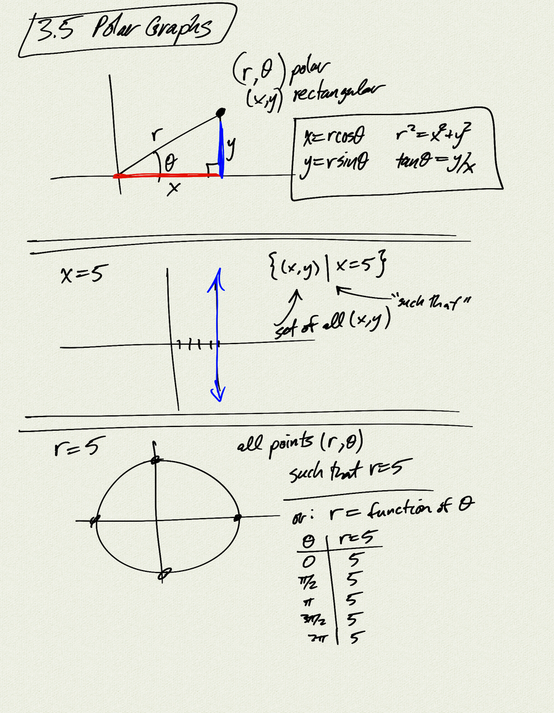
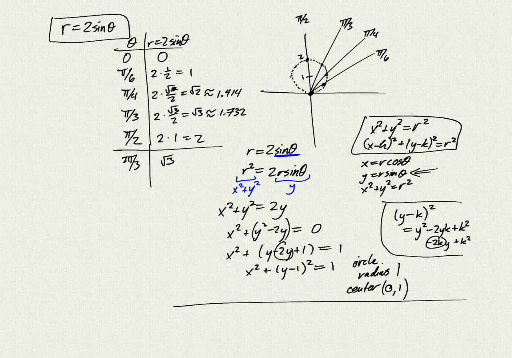
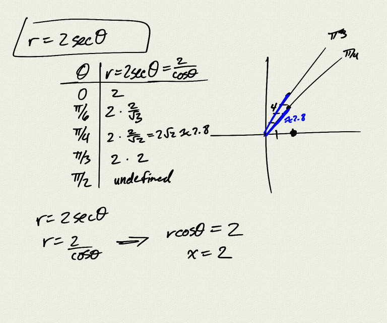
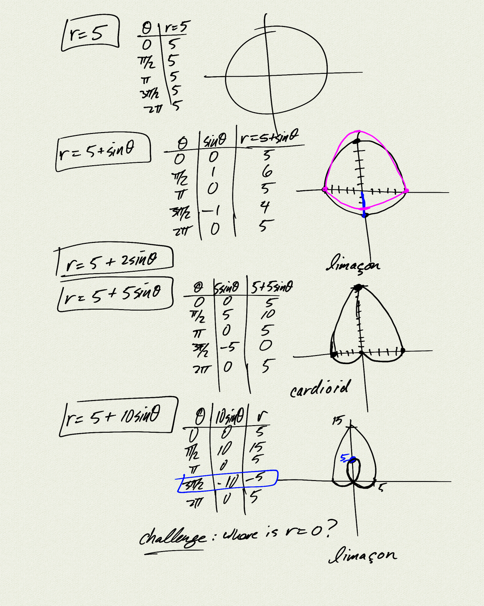
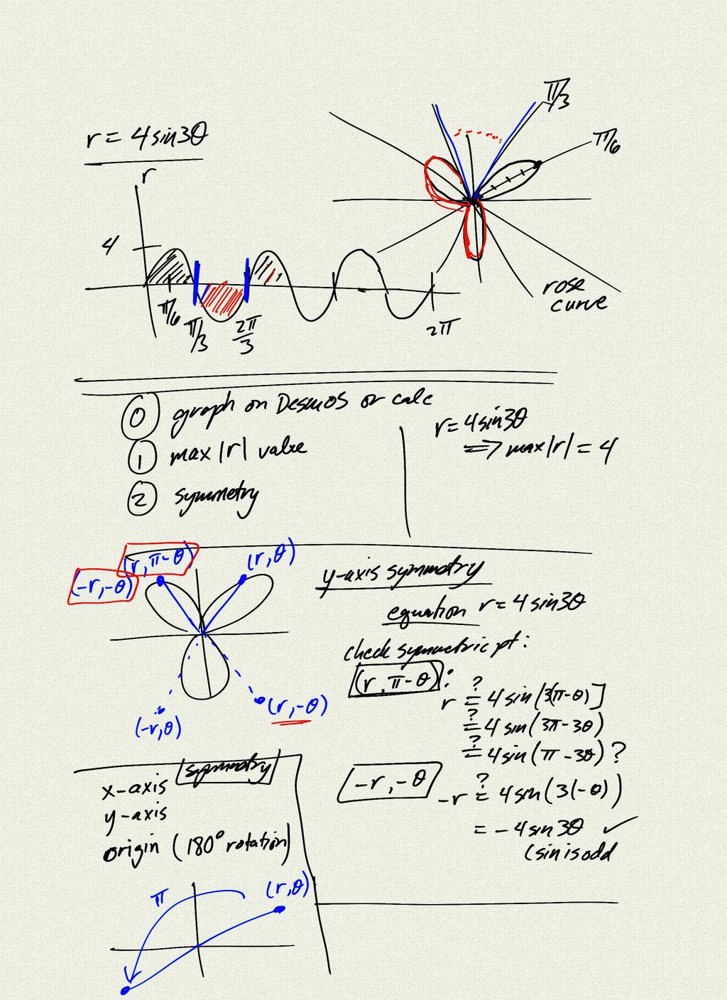

Topics: 

- polar equations
- converting polar equations to rectangular coordinates
- polar graphs
- polar graph analysis:
    - max \|r\| value
    - symmetry (x-axis, y-axis, origin)

Reference:
[OSP 8.4](https://openstax.org/books/precalculus/pages/8-4-polar-coordinates-graphs)  

[Example problem](example)

[notes (pdf)](PCHA_3.5_PolarGraphs.pdf)

<iframe class="video" src="https://www.youtube.com/embed/pRjhuQ5FA0I" title="YouTube video player" frameborder="0" allow="accelerometer; autoplay; clipboard-write; encrypted-media; gyroscope; picture-in-picture" allowfullscreen></iframe>

