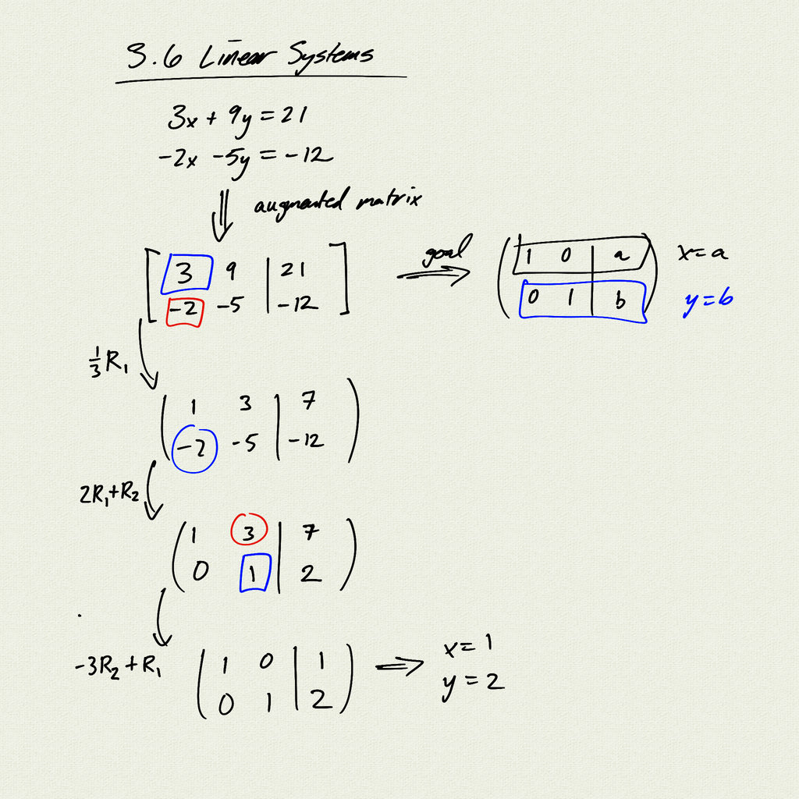
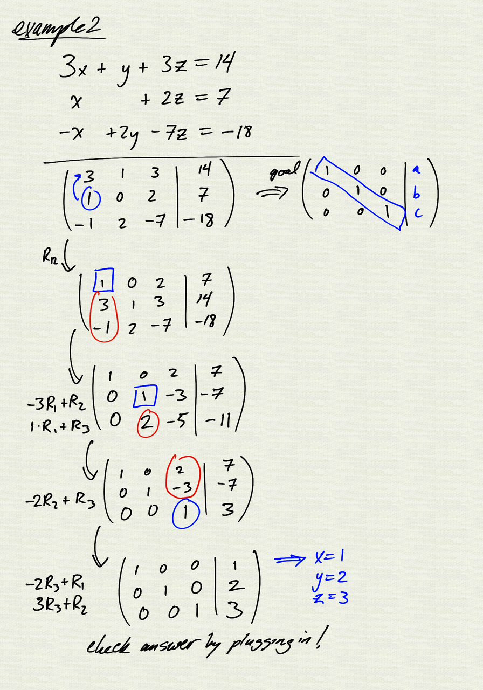

Topics: 

- systems of linear equations
- augmented matrix
- Gaussian elimination

Reference:
[OSP 9.6](https://openstax.org/books/precalculus/pages/9-6-solving-systems-with-gaussian-elimination)  

[notes (pdf)](PCHA_3.6_LinearSystems.pdf)

<iframe class="video" src="https://www.youtube.com/embed/u2P_DX_sFXU" title="YouTube video player" frameborder="0" allow="accelerometer; autoplay; clipboard-write; encrypted-media; gyroscope; picture-in-picture" allowfullscreen></iframe>
