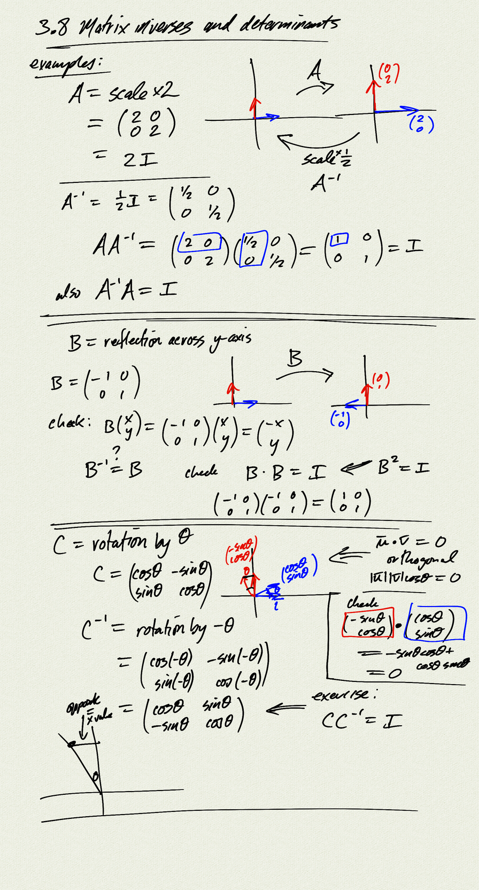
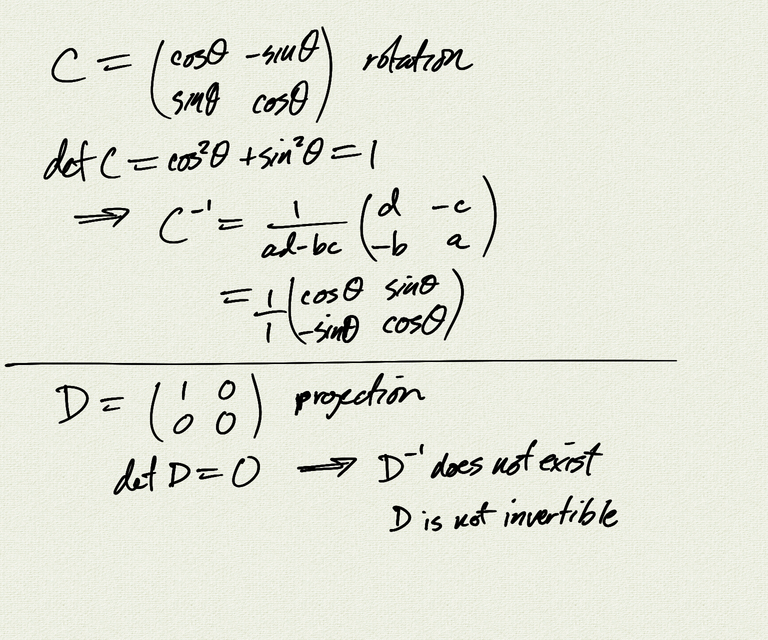

Topics: 

- matrix inverses
- determinants

Reference:
[OSP 9.8](https://openstax.org/books/precalculus/pages/9-8-solving-systems-with-cramers-rule)  

[Homework handout](handout)  
[Homework handout (pdf)](handout.pdf)

[notes (pdf)](PCHA_3.8_MatrixInverses.pdf)

<iframe class="video" src="https://www.youtube.com/embed/9_697LP4aCw" title="YouTube video player" frameborder="0" allow="accelerometer; autoplay; clipboard-write; encrypted-media; gyroscope; picture-in-picture" allowfullscreen></iframe>

