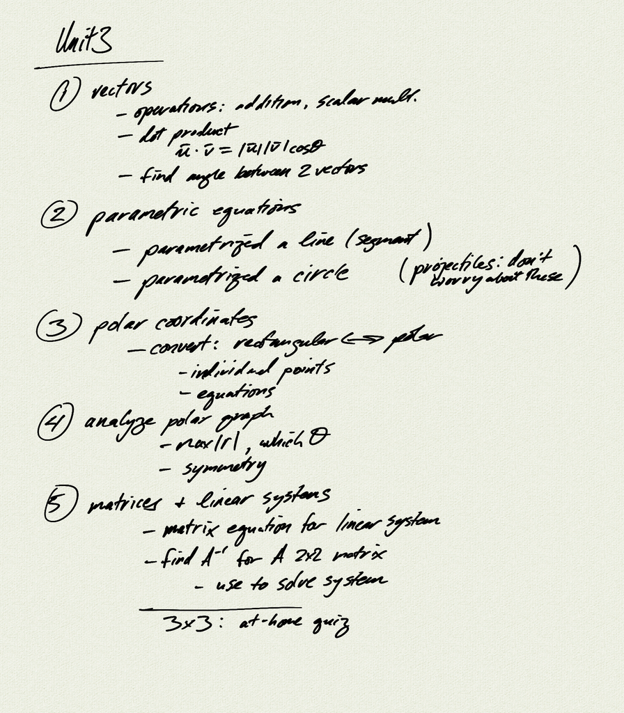
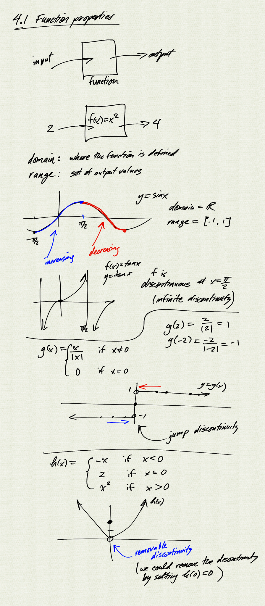
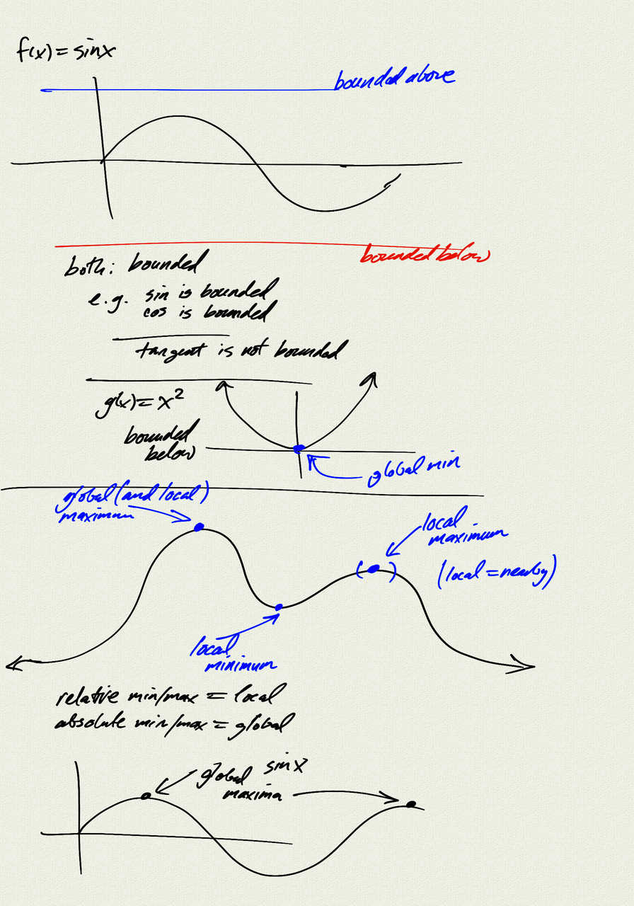
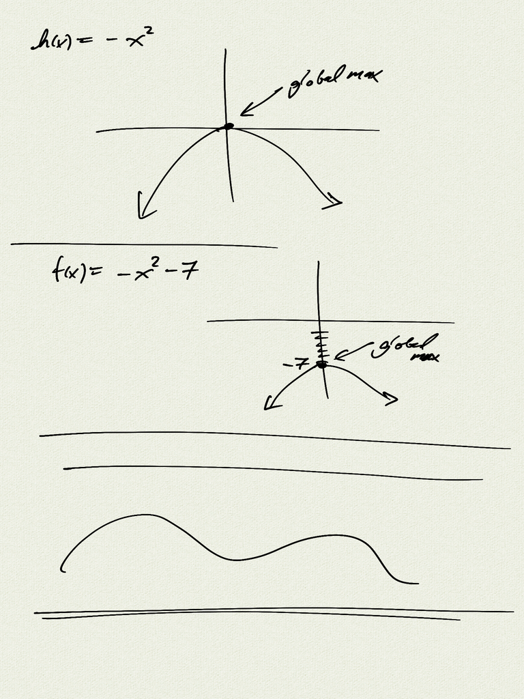
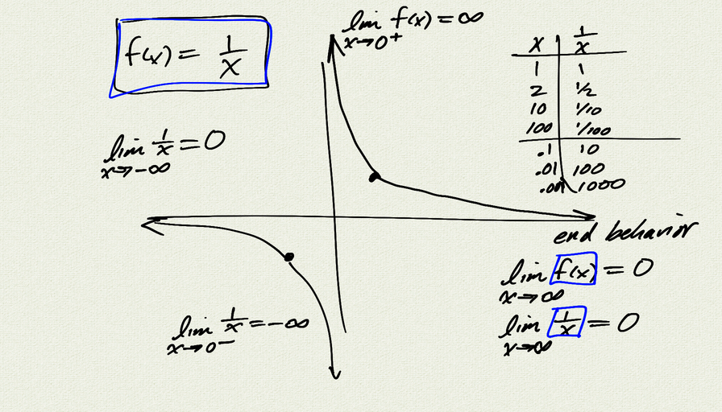
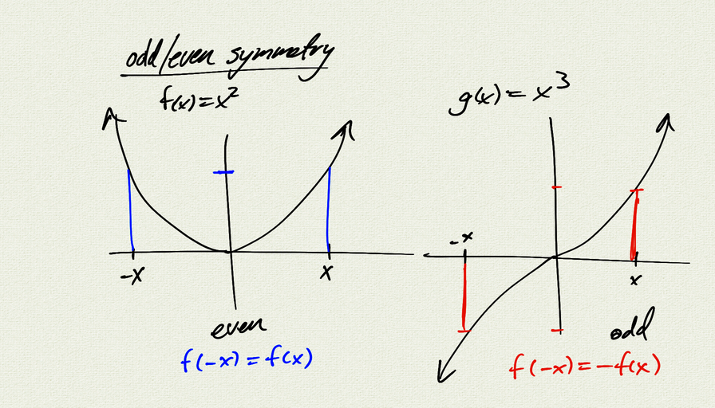

Topics: 

- domain and range
- increasing / decreasing
- continuity
    - discontinuities: removable, jump, infinite
- boundedness (above/below)
- local/global extrema (min/max)
- odd/even symmetry
- asymptotes and end behavior 
    - limit notation

Reference:
[Stitz-Zeager Precalculus](https://www.stitz-zeager.com/)
SZ 1.6 Graphs of Functions

[Homework handout](handout)  
[Homework handout (pdf)](handout.pdf)

[notes (pdf)](PCHA_4.1_FunctionProperties.pdf)

<iframe class="video" src="https://www.youtube.com/embed/AuKYJd7cEyc" title="YouTube video player" frameborder="0" allow="accelerometer; autoplay; clipboard-write; encrypted-media; gyroscope; picture-in-picture" allowfullscreen></iframe>

