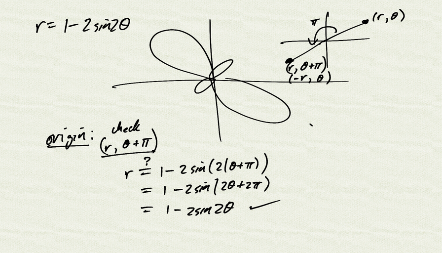
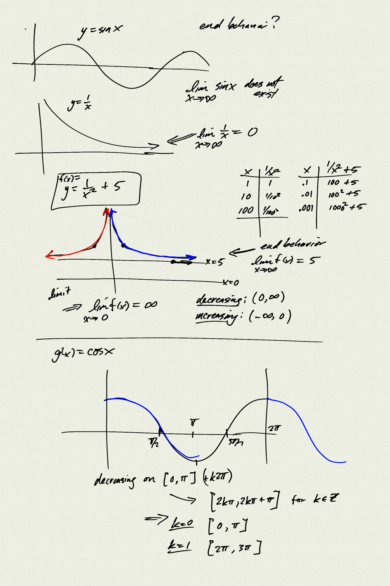
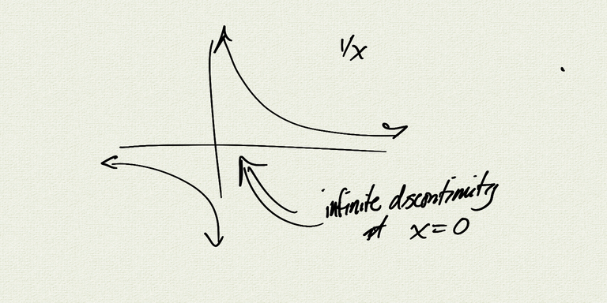
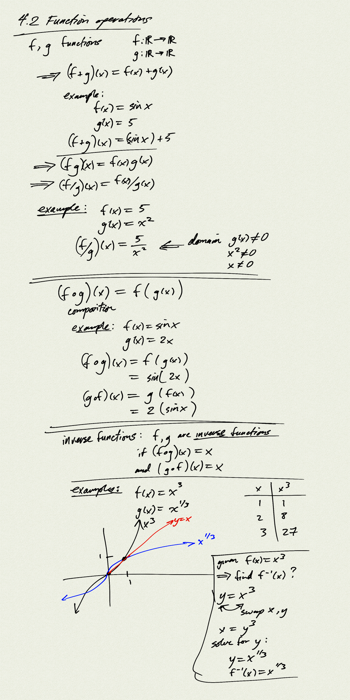
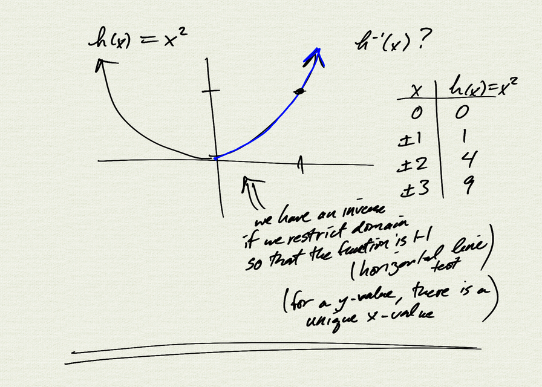
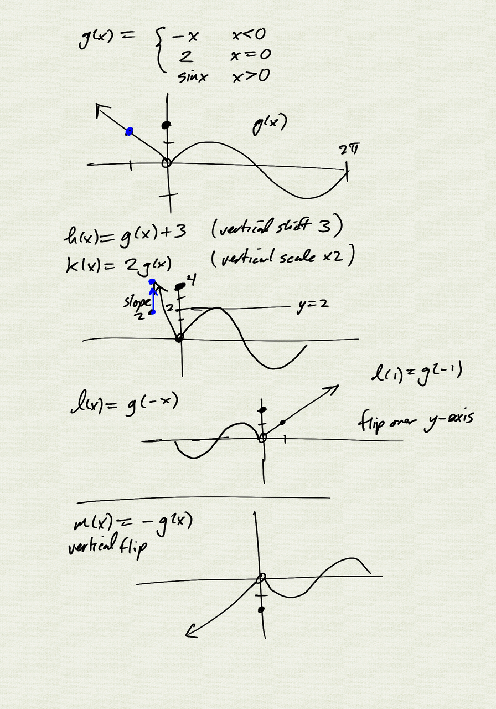
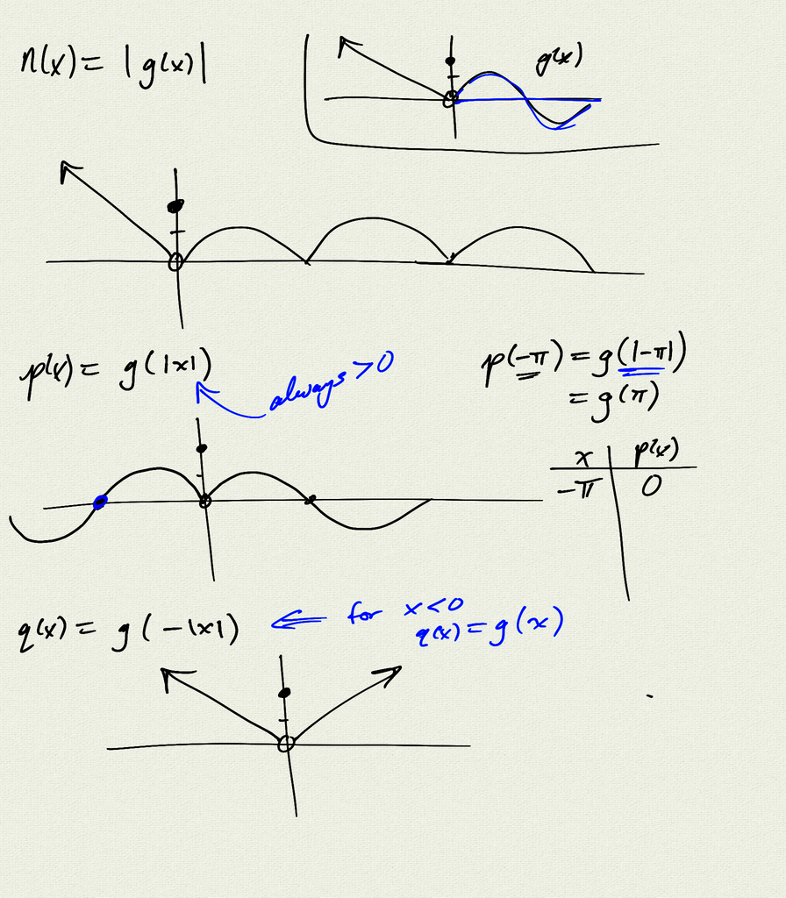
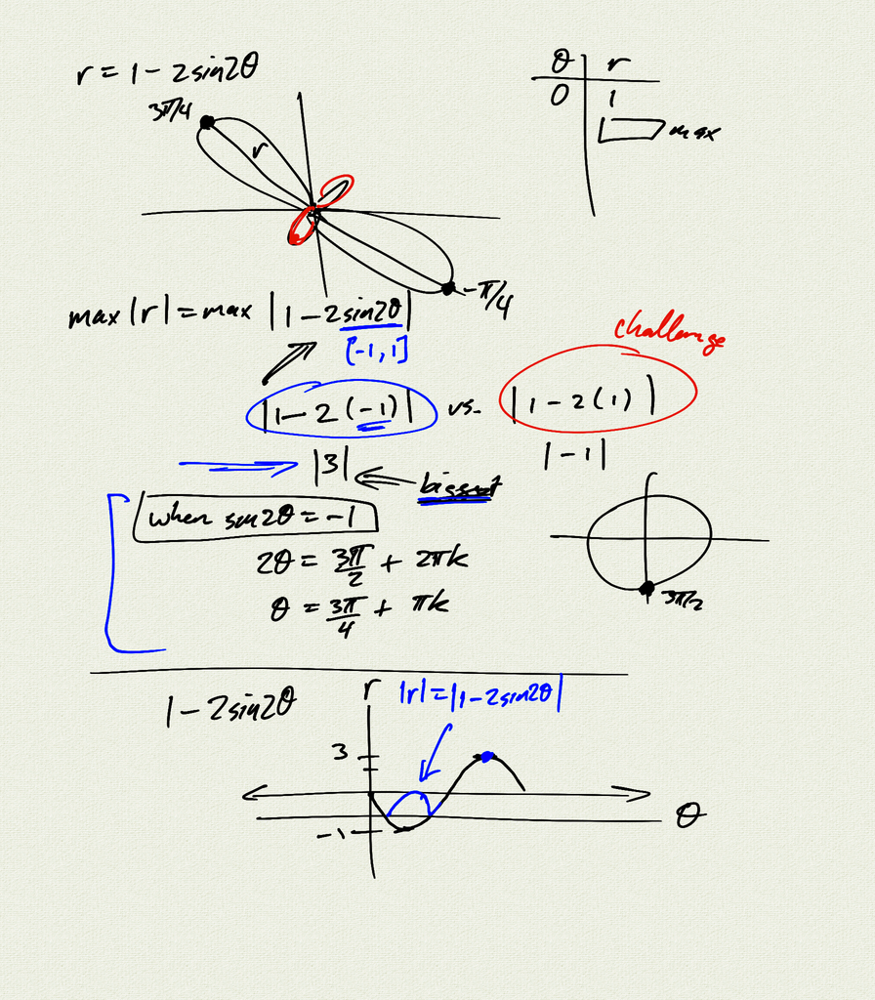

Topics: 
- function operations:   
    $f+g, \quad f-g,  \quad fg, \quad f/g$
- function composition:   
    $(f \circ g)(x) = f\left(g(x)\right)$
- inverse functions
    - finding inverse functions
    - 1-1 functions / horizontal line test
- function transformations

Reference:
[Stitz-Zeager Precalculus](https://www.stitz-zeager.com/)
- SZ 1.5 Function Arithmetic
- SZ 1.7 Transformations
- SZ 5.1 Function Composition
- SZ 5.2 Inverse Functions

[notes (pdf)](PCHA_4.2_FunctionOperations.pdf)

<iframe class="video" src="https://www.youtube.com/embed/irTeIcUqeEs" title="YouTube video player" frameborder="0" allow="accelerometer; autoplay; clipboard-write; encrypted-media; gyroscope; picture-in-picture" allowfullscreen></iframe>

