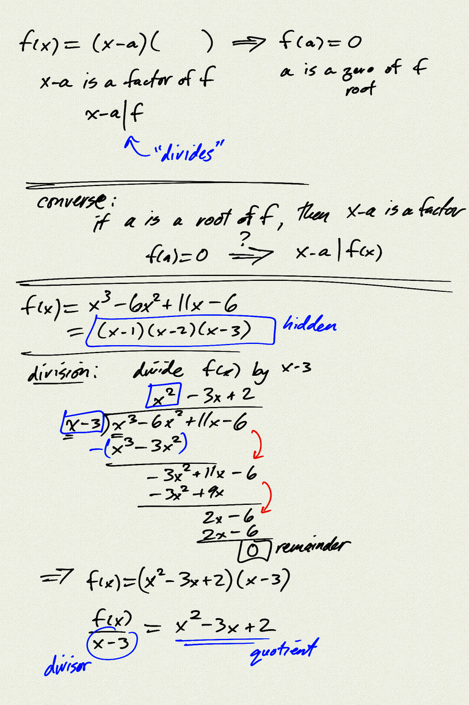

Topics: 
- polynomials
    - $p(x) = a_n x^n + a_{n-1}x^{n-1} + ... a_1 x + a_0$
    - leading term $a_n x^n$, degree, and end behavior
    - constant term $a_0$: y-intercept
- polynomial division
    - dividing polynomial $p(x)$ by divisor $d(x)$ gives us a quotient $q(x)$ and
      a remainder $r(x)$ with $\deg(r) < \deg(d)$
        - $p(x) = q(x)d(x) + r(x)$
        - $\dfrac{p(x)}{d(x)} = q(x) + \dfrac{r(x)}{d(x)}$
- Remainder theorem:
    - $p(x) = q(x)(x-a) + r$
    - When dividing a polynomial $p(x)$ by $x-a$, the remainder is $p(a)$.
- Factor theorem:
    - $(x-a) \,\|\, p(x) \quad\Leftrightarrow\quad p(a) = 0$ 
    - $x-a$ is a factor of $p(x)$ $\;\Leftrightarrow\;$ $a$ is a root (zero) of $p(x)$

Reference:  
[OSP 3.4](https://openstax.org/books/precalculus/pages/3-4-graphs-of-polynomial-functions)  
[OSP 3.5](https://openstax.org/books/precalculus/pages/3-5-dividing-polynomials)  
[OSP 3.6](https://openstax.org/books/precalculus/pages/3-6-zeros-of-polynomial-functions)  

[notes (pdf)](PCHA_4.3_Polynomials.pdf)

<iframe class="video" src="https://www.youtube.com/embed/YShVWIbBVfw" title="YouTube video player" frameborder="0" allow="accelerometer; autoplay; clipboard-write; encrypted-media; gyroscope; picture-in-picture" allowfullscreen></iframe>

