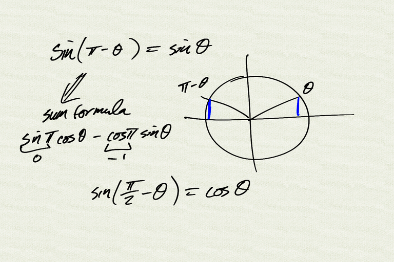

Topics: 
- synthetic division
- Rational Zeros Theorem

Reference:  
[OSP 3.6](https://openstax.org/books/precalculus/pages/3-6-zeros-of-polynomial-functions)  

[notes (pdf)](PCHA_4.4_MorePolynomials.pdf)

<iframe class="video" src="https://www.youtube.com/embed/jgabfWYHbDk" title="YouTube video player" frameborder="0" allow="accelerometer; autoplay; clipboard-write; encrypted-media; gyroscope; picture-in-picture" allowfullscreen></iframe>

