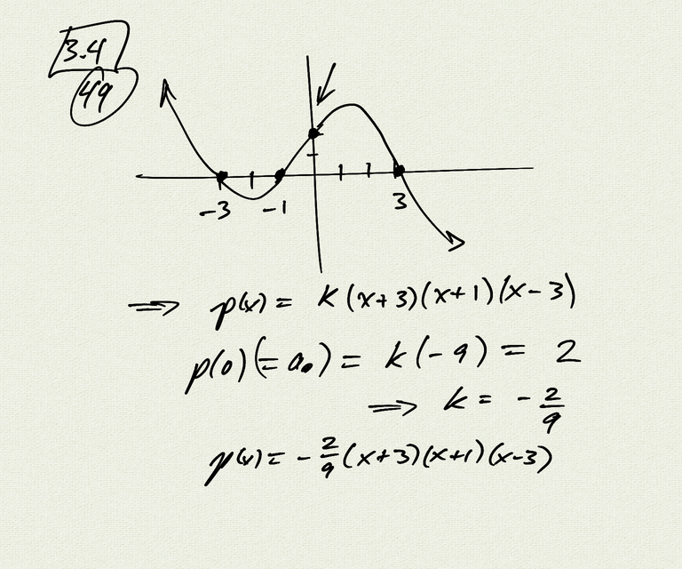
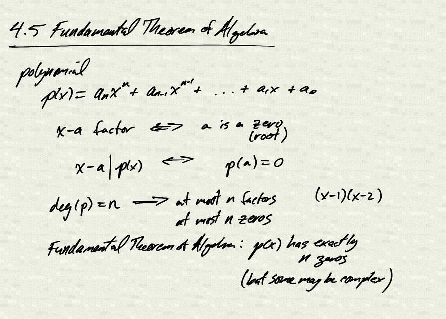
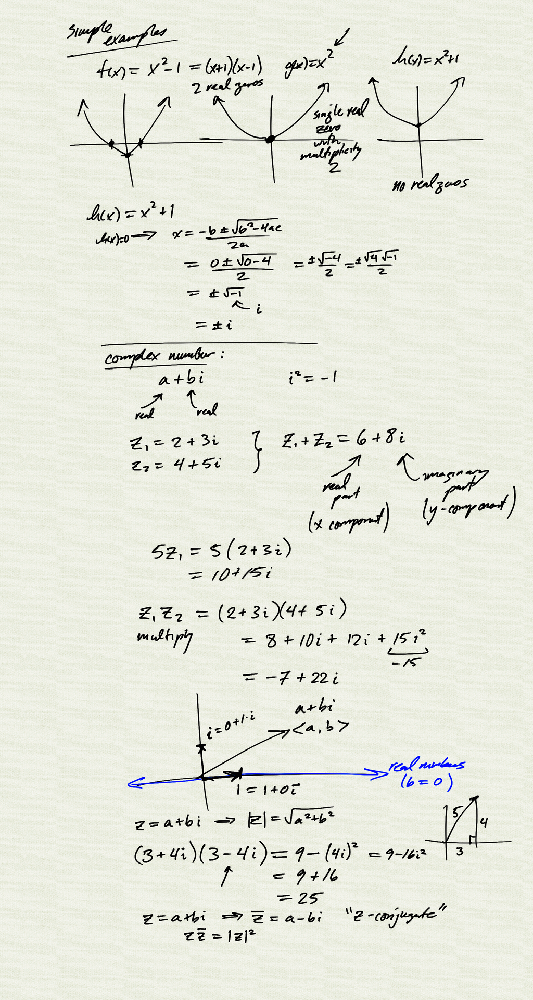
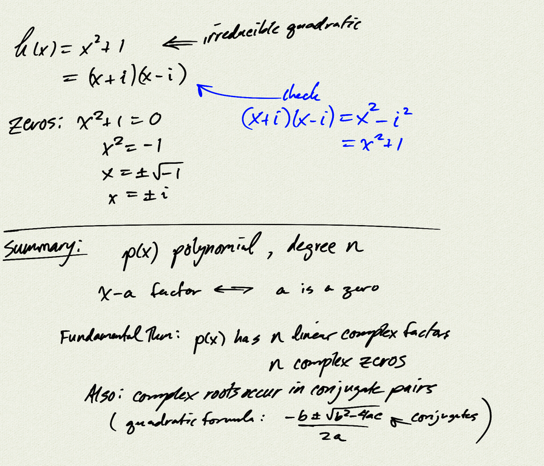
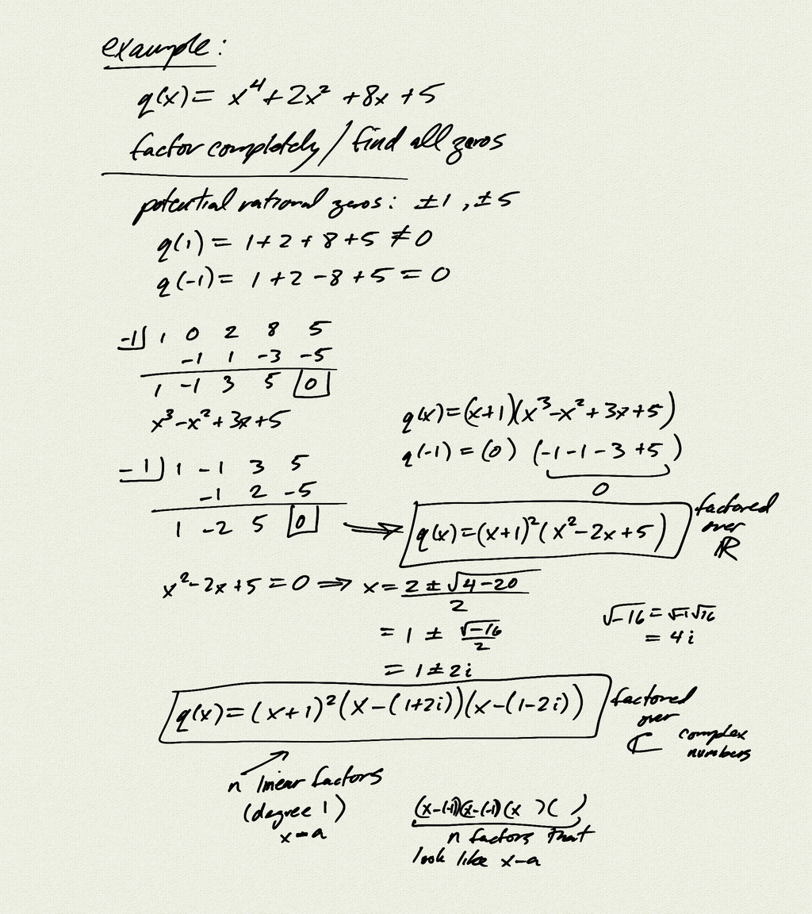
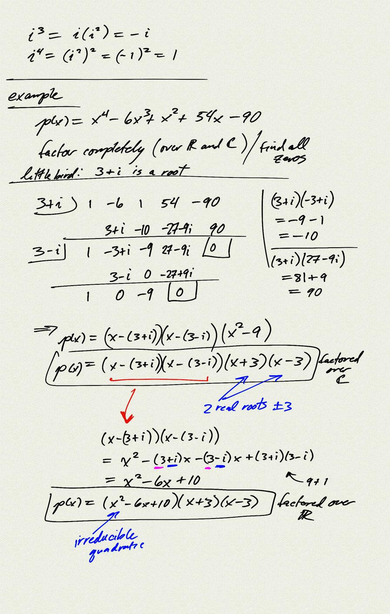

Topics: 
- Fundamental Theorem of Algebra
- Complex numbers
    - multiplication
    - vector interpretation
    - complex conjugates

Reference:  
[OSP 3.6](https://openstax.org/books/precalculus/pages/3-6-zeros-of-polynomial-functions)  

[notes (pdf)](PCHA_4.5_FundamentalTheoremOfAlgebra.pdf)

<iframe class="video" src="https://www.youtube.com/embed/CAd34XrEKRM" title="YouTube video player" frameborder="0" allow="accelerometer; autoplay; clipboard-write; encrypted-media; gyroscope; picture-in-picture" allowfullscreen></iframe>
