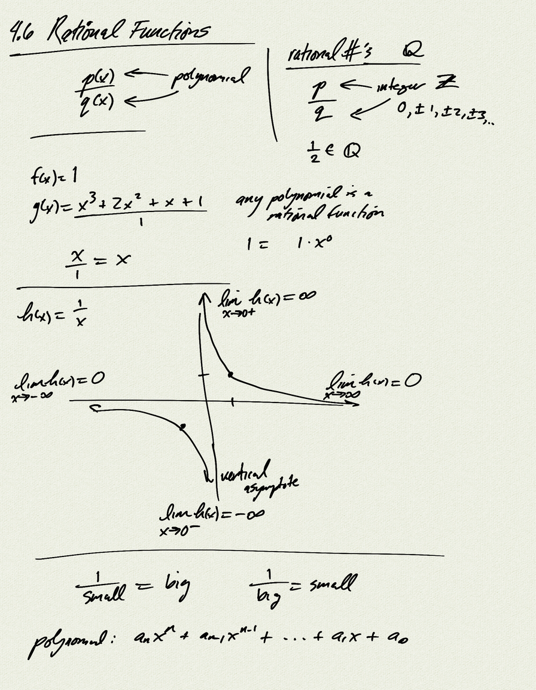

Topics: 
- rational functions
    - end behavior
    - limits at asymptotes

Reference:  
[OSP 3.7](https://openstax.org/books/precalculus/pages/3-7-rational-functions)  

[notes (pdf)](PCHA_4.6_RationalFunctions.pdf)

<iframe class="video" src="https://www.youtube.com/embed/6ToYoj3Px0Y" title="YouTube video player" frameborder="0" allow="accelerometer; autoplay; clipboard-write; encrypted-media; gyroscope; picture-in-picture" allowfullscreen></iframe>

