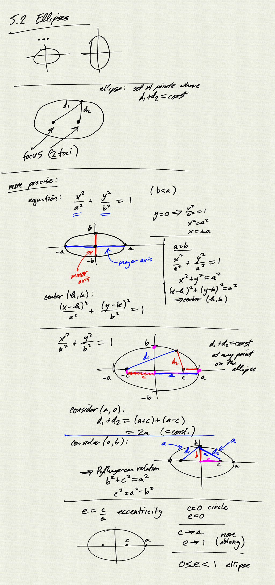
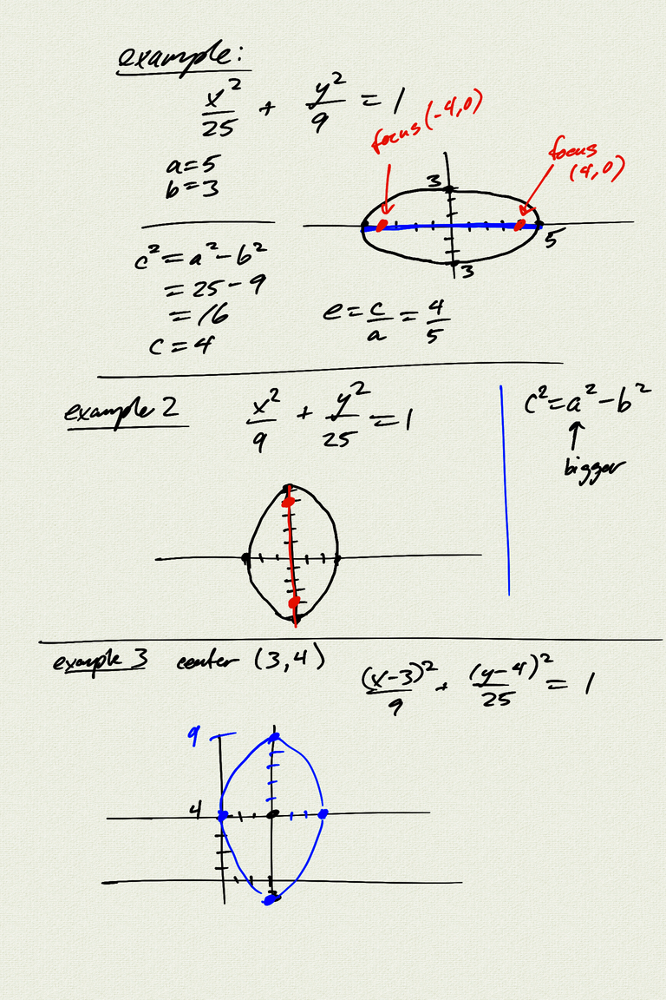
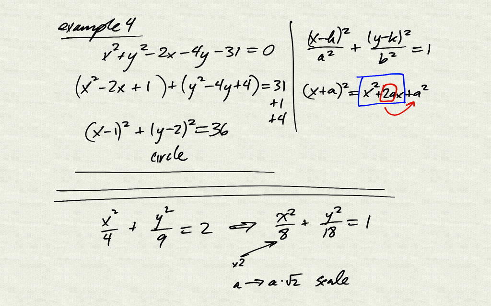

Topics: 
- ellipses
    - geometric definition
    - foci
    - Pythagorean relation
    - eccentricity

Reference:  
[OSP 10.1](https://openstax.org/books/precalculus/pages/10-1-the-ellipse)  

[notes (pdf)](PCHA_5.2_Ellipses.pdf)

<iframe class="video" src="https://www.youtube.com/embed/nC1_RNOspz0" title="YouTube video player" frameborder="0" allow="accelerometer; autoplay; clipboard-write; encrypted-media; gyroscope; picture-in-picture" allowfullscreen></iframe>

