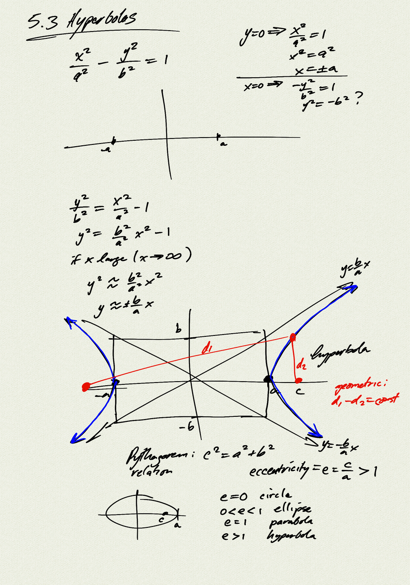
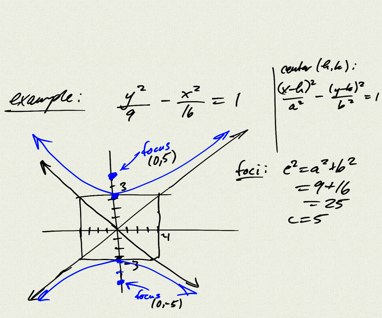
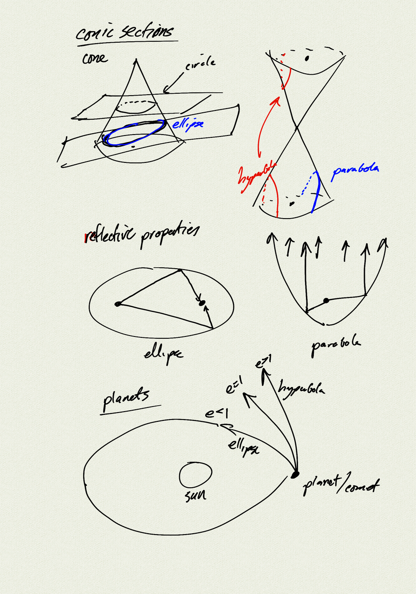
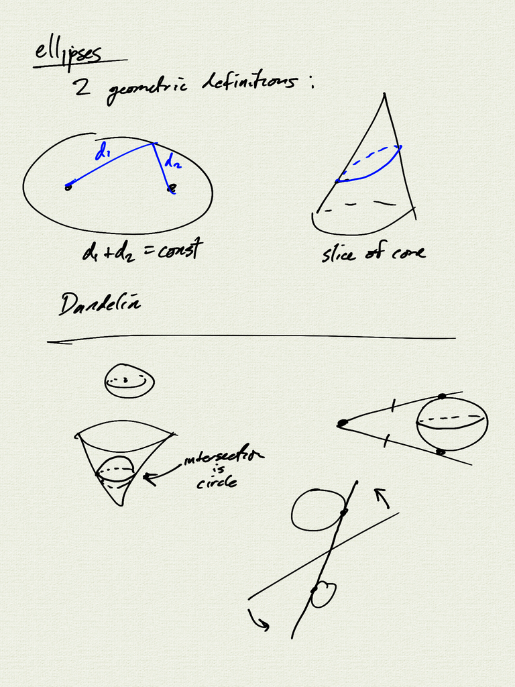

Topics: 
- hyperbolas
    - geometric definition
    - foci
    - Pythagorean relation
    - eccentricity
- conic sections
- reflection properties
- Dandelin Spheres

[Dandelin Sphere demo](https://stem.marlborough.org/explorations/dandelin/)

Reference:  
[OSP 10.2](https://openstax.org/books/precalculus/pages/10-2-the-hyperbola)  

[notes (pdf)](PCHA_5.3_Hyperbolas.pdf)

<iframe class="video" src="https://www.youtube.com/embed/zhX0oeLJLVc" title="YouTube video player" frameborder="0" allow="accelerometer; autoplay; clipboard-write; encrypted-media; gyroscope; picture-in-picture" allowfullscreen></iframe>

