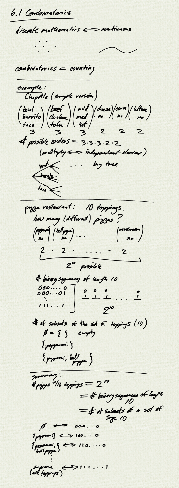
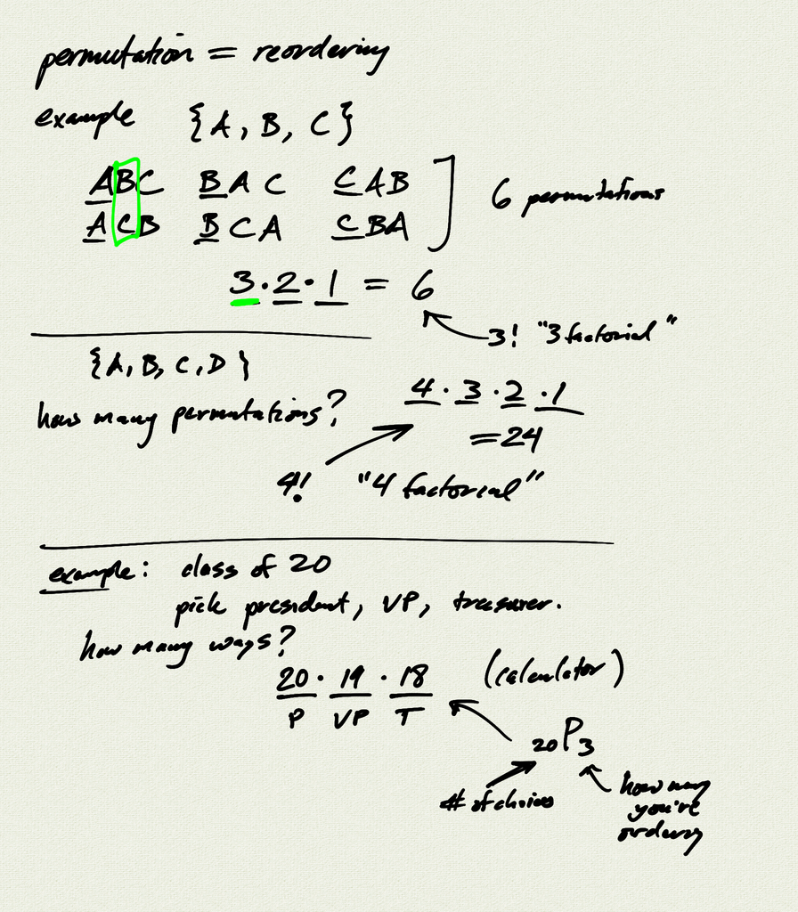
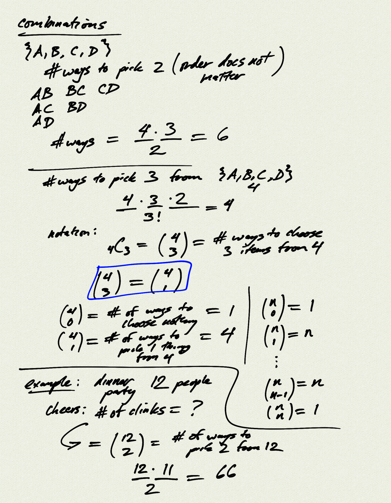

Topics: 
- counting
- permutations
- combinations

[Homework handout](hw6.1)  
[Homework handout (pdf)](hw6.1.pdf)

Reference:  
[OSP 11.5](https://openstax.org/books/precalculus/pages/11-5-counting-principles)  

[notes (pdf)](PCHA_6.1_Combinatorics.pdf)

<iframe width="560" height="315" src="https://www.youtube.com/embed/0j7H8vsh0eI" title="YouTube video player" frameborder="0" allow="accelerometer; autoplay; clipboard-write; encrypted-media; gyroscope; picture-in-picture" allowfullscreen></iframe>

