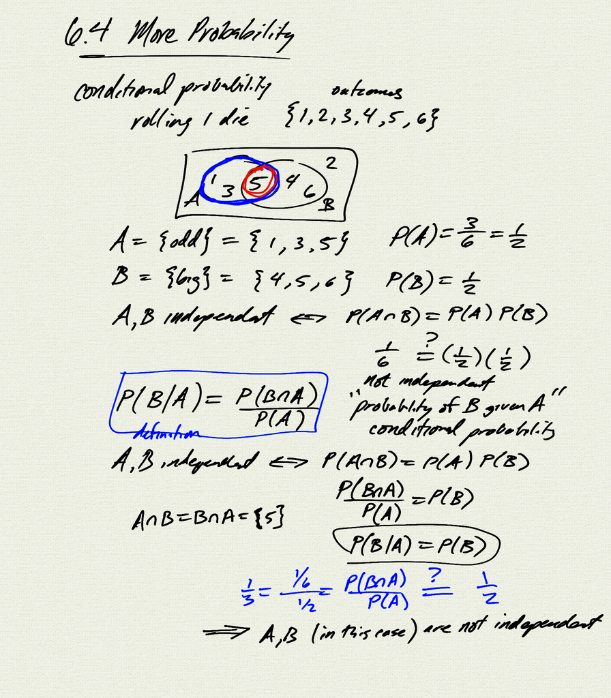
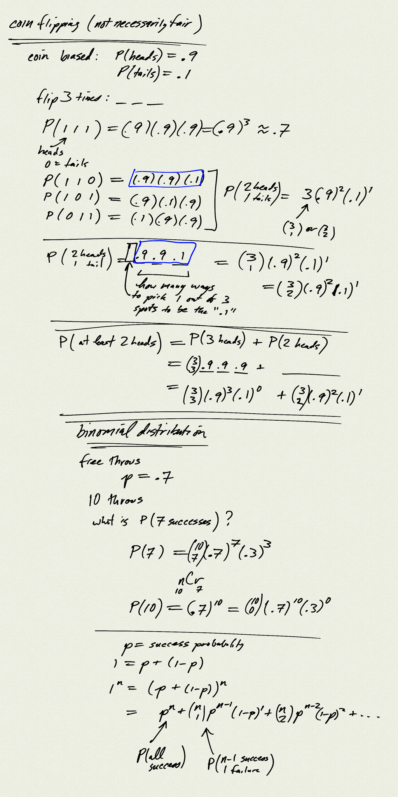
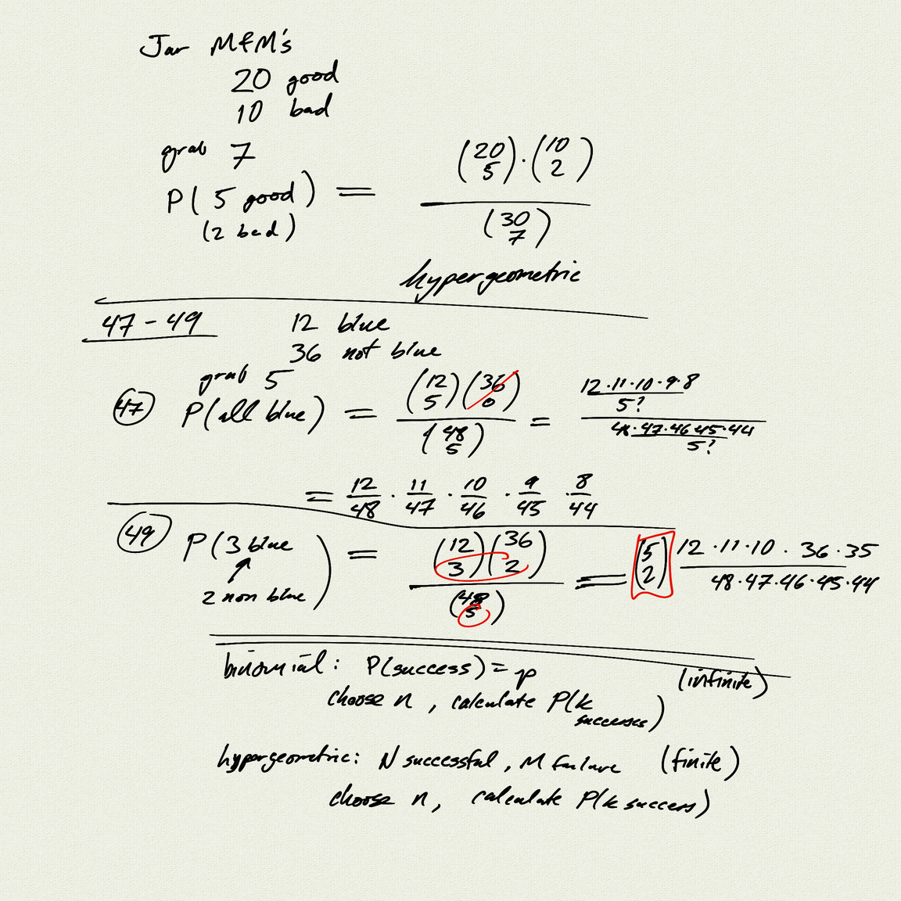

Topics: 
- conditional probability
- binomial distribution
- hypergeometric distribution

Reference:  
[OSP 11.7](https://openstax.org/books/precalculus/pages/11-7-probability)  

[binomial.ipynb](binomial.ipynb)  
[binomial.ipynb (view on GitHub)](https://github.com/dkessner/PCHA/blob/main/6.4_more_probability/binomial.ipynb)

[notes (pdf)](PCHA_6.4_MoreProbability.pdf)

<iframe width="560" height="315" src="https://www.youtube.com/embed/BvuwL02ksnk" title="YouTube video player" frameborder="0" allow="accelerometer; autoplay; clipboard-write; encrypted-media; gyroscope; picture-in-picture" allowfullscreen></iframe>

