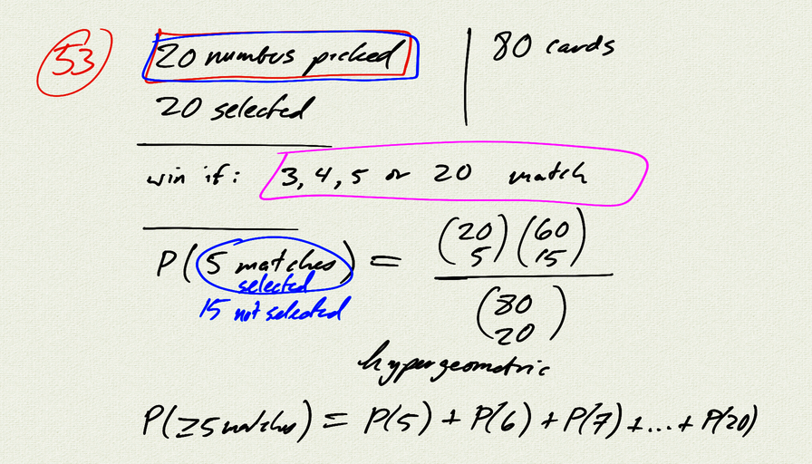
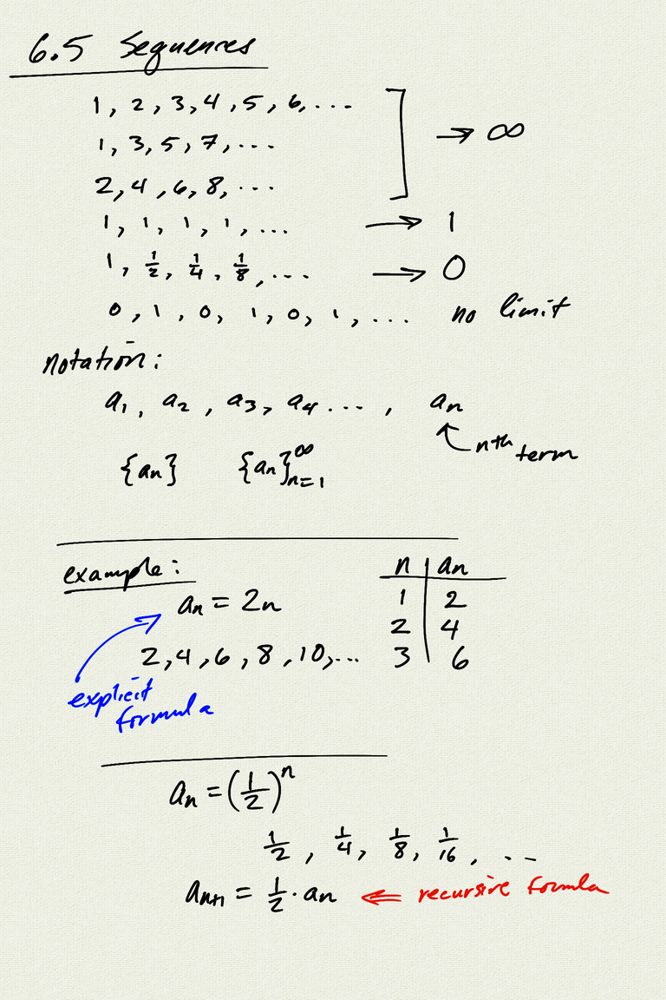
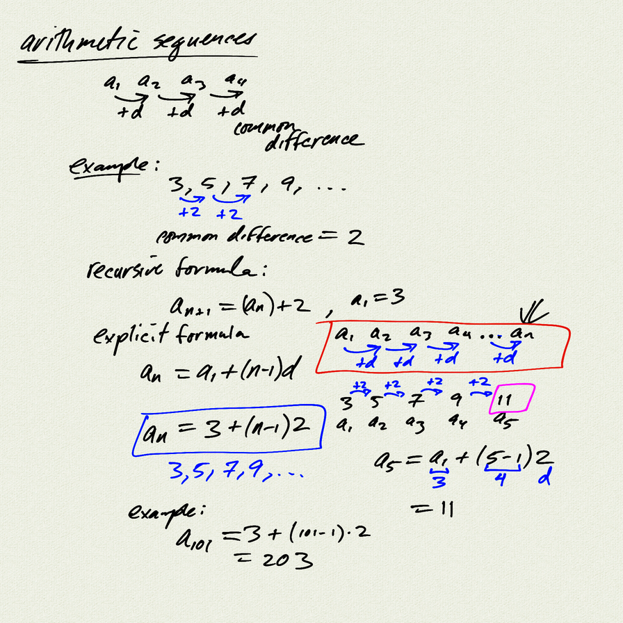
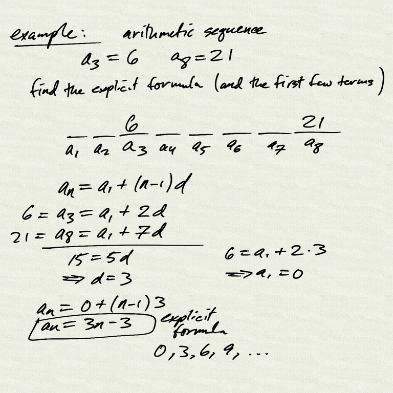
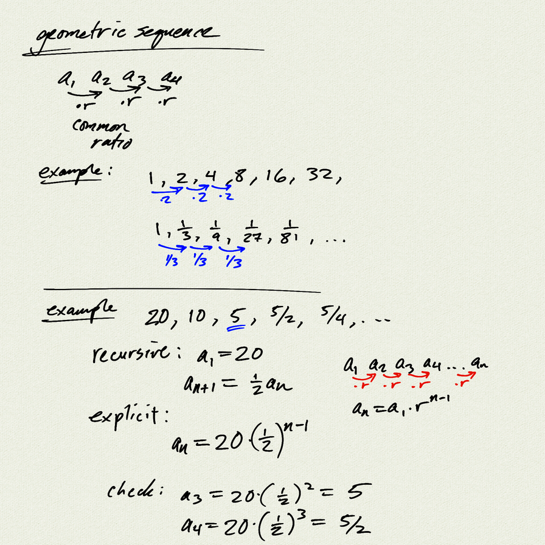
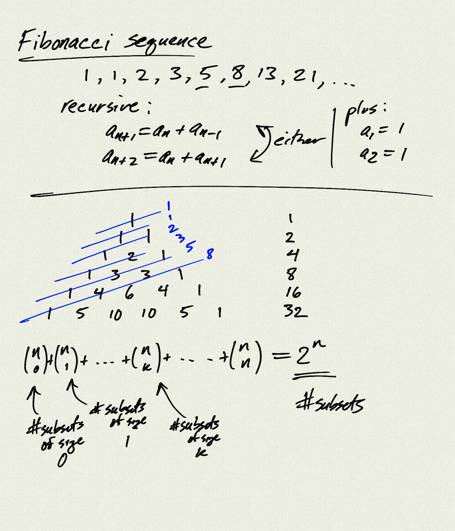

Topics: 
- sequences
- recursive and explicit definitions
- arithmetic and geometric sequences

Reference:  
[OSP 11.1](https://openstax.org/books/precalculus/pages/11-1-sequences-and-their-notations)   
[OSP 11.2](https://openstax.org/books/precalculus/pages/11-2-arithmetic-sequences)  
[OSP 11.3](https://openstax.org/books/precalculus/pages/11-3-geometric-sequences)  

[notes (pdf)](PCHA_6.5_Sequences.pdf)

<iframe width="560" height="315" src="https://www.youtube.com/embed/Iib8fMqhPo4" title="YouTube video player" frameborder="0" allow="accelerometer; autoplay; clipboard-write; encrypted-media; gyroscope; picture-in-picture" allowfullscreen></iframe>

