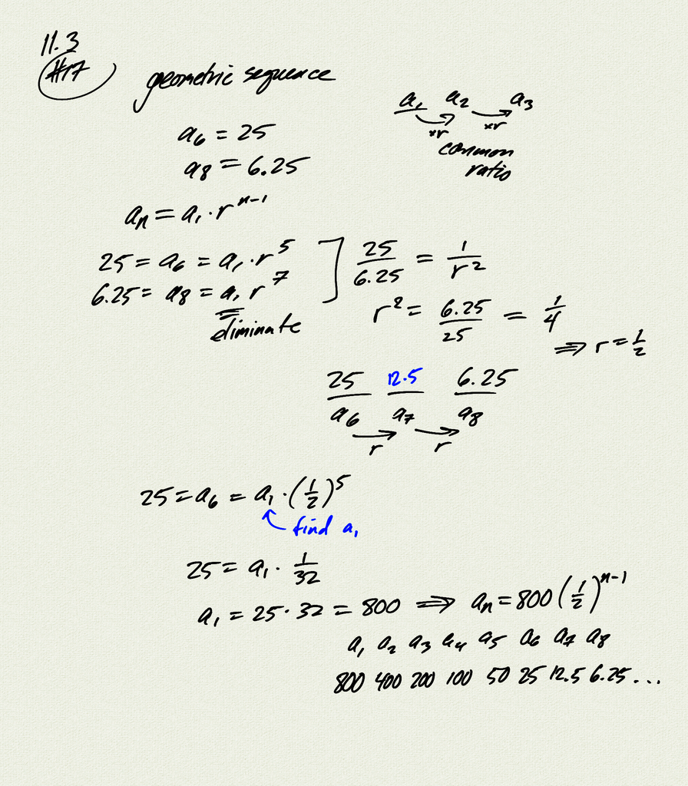
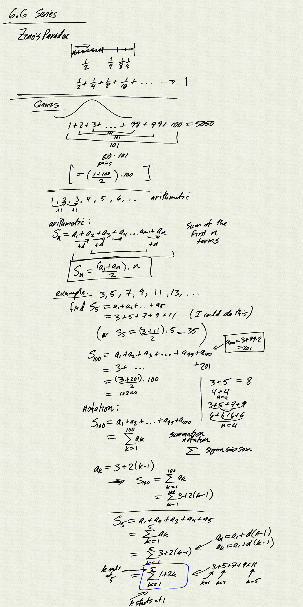
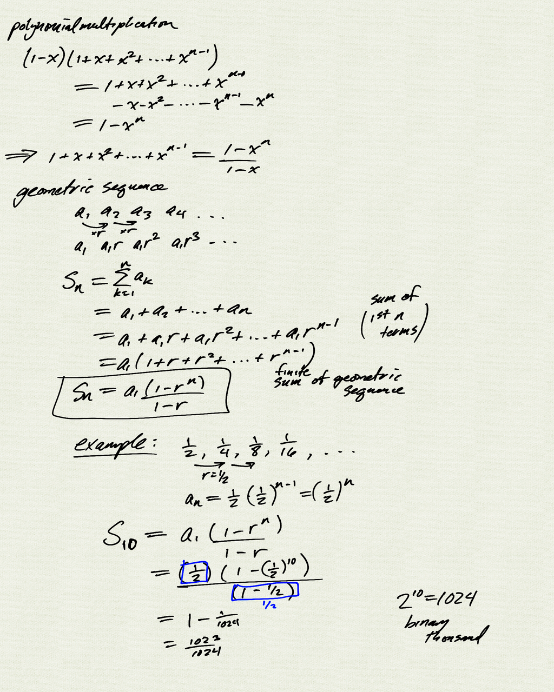
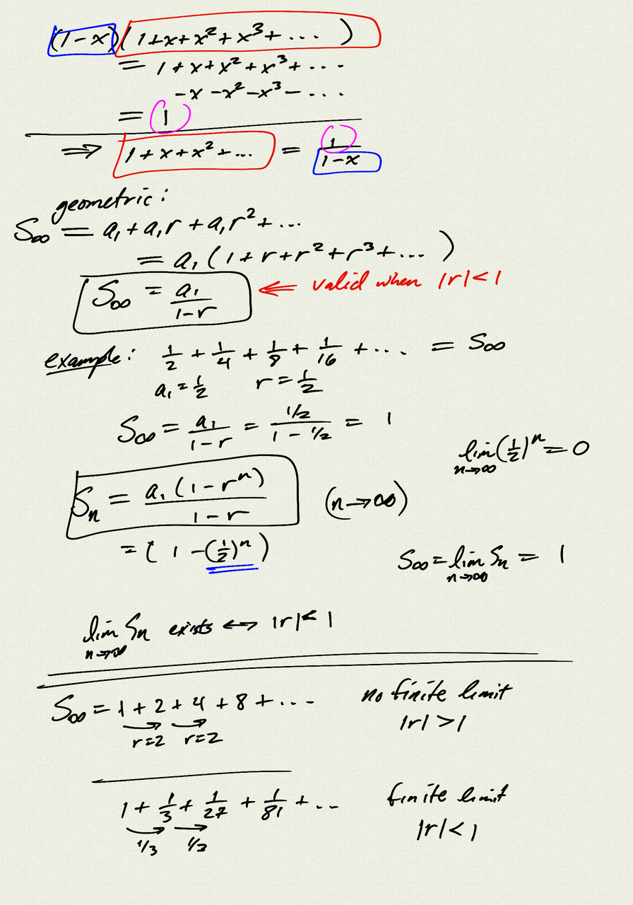
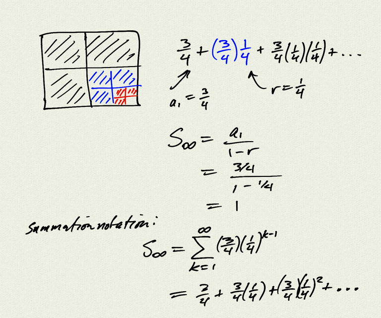

Topics: 
- finite sums of arithmetic and geometric sequences
- summation notation
- infinite geometric series

Reference:  [OSP 11.4](https://openstax.org/books/precalculus/pages/11-4-series-and-their-notations)  

[notes (pdf)](PCHA_6.6_Series.pdf)

<iframe width="560" height="315" src="https://www.youtube.com/embed/lYXnrDcSzck" title="YouTube video player" frameborder="0" allow="accelerometer; autoplay; clipboard-write; encrypted-media; gyroscope; picture-in-picture" allowfullscreen></iframe>

