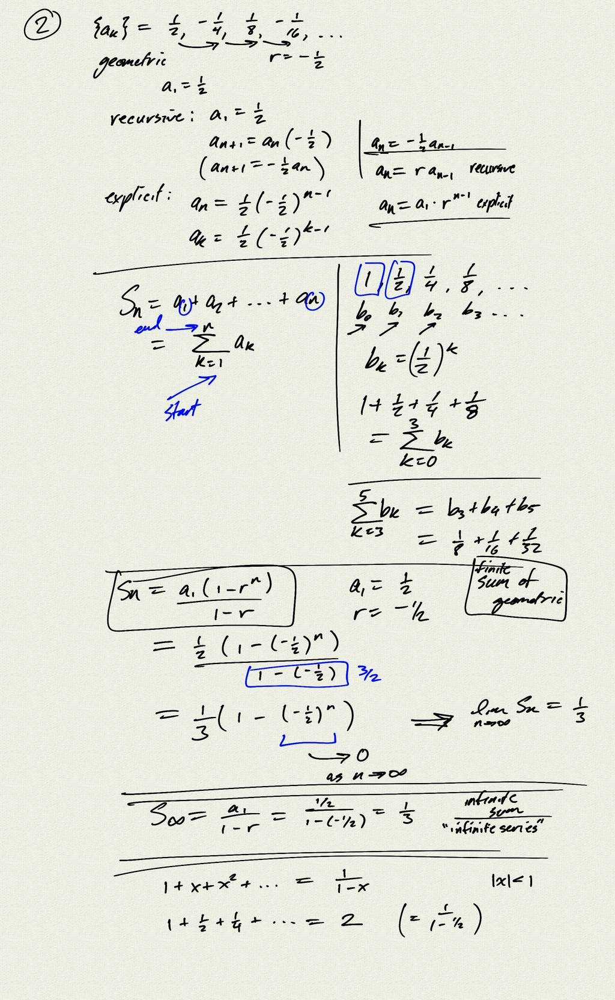
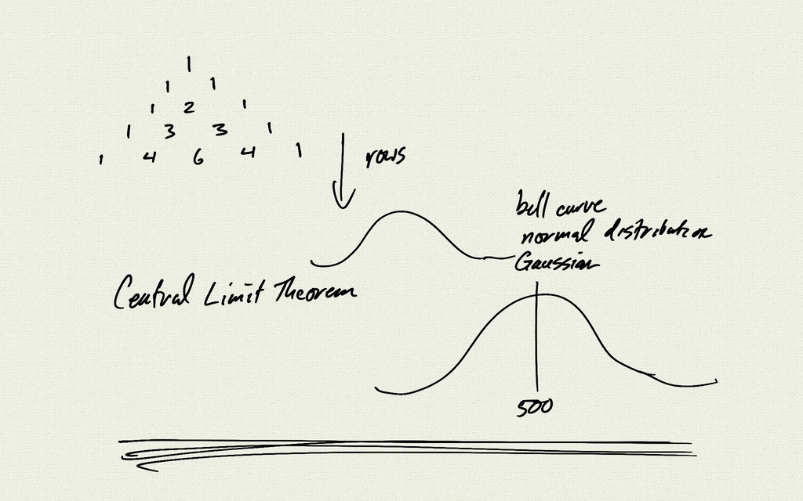
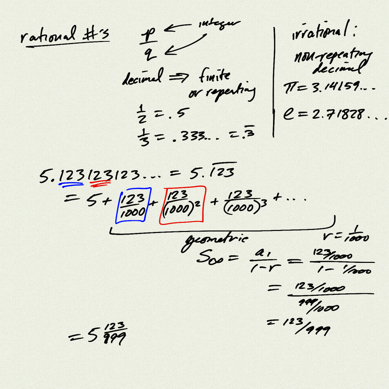
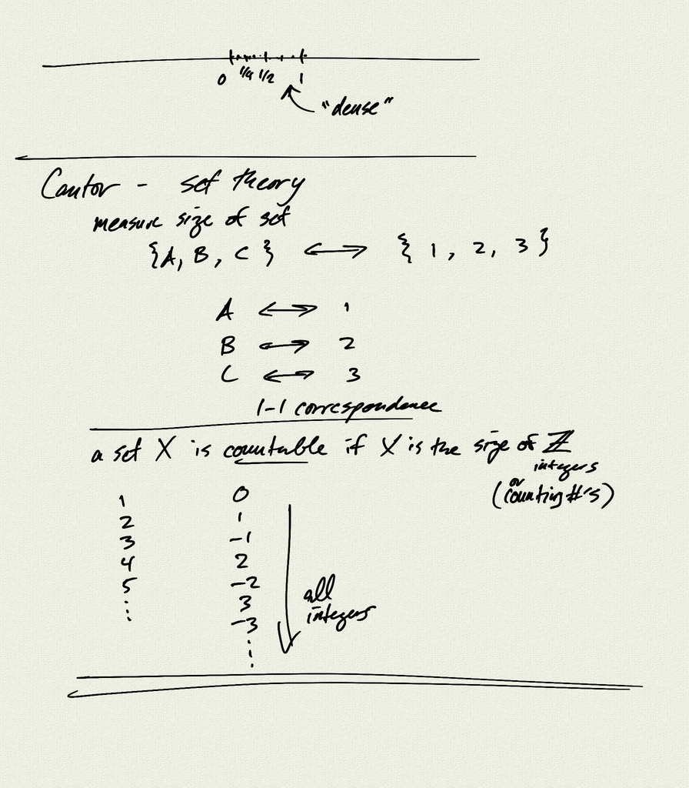
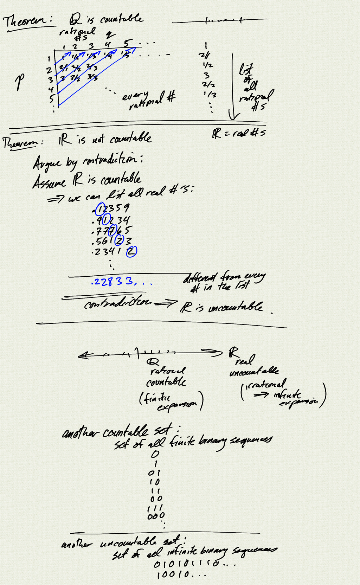
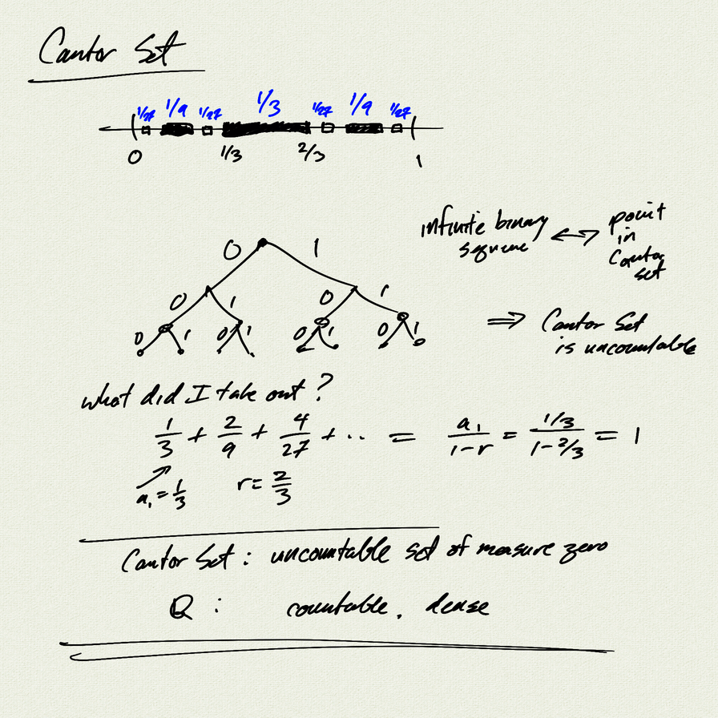

Topics: 
- Central Limit Theorem
- countable and uncountable sets
- $\mathbb{Q}$ is countable, $\mathbb{R}$ is uncountable
- Cantor Set

[notes (pdf)](PCHA_6.7_Infinity.pdf)

<iframe width="560" height="315" src="https://www.youtube.com/embed/4wVoKI2bBfE" title="YouTube video player" frameborder="0" allow="accelerometer; autoplay; clipboard-write; encrypted-media; gyroscope; picture-in-picture" allowfullscreen></iframe>

