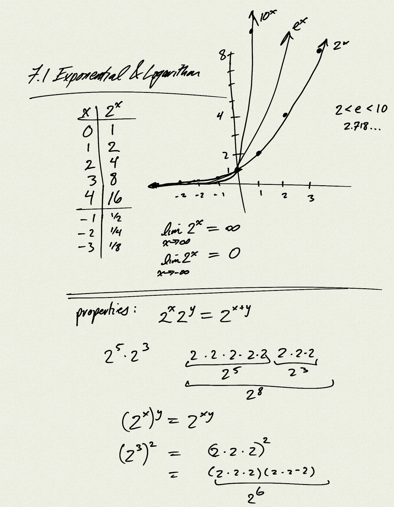
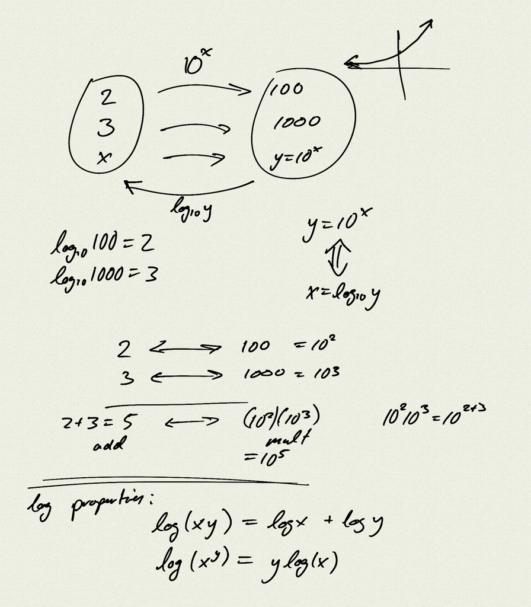
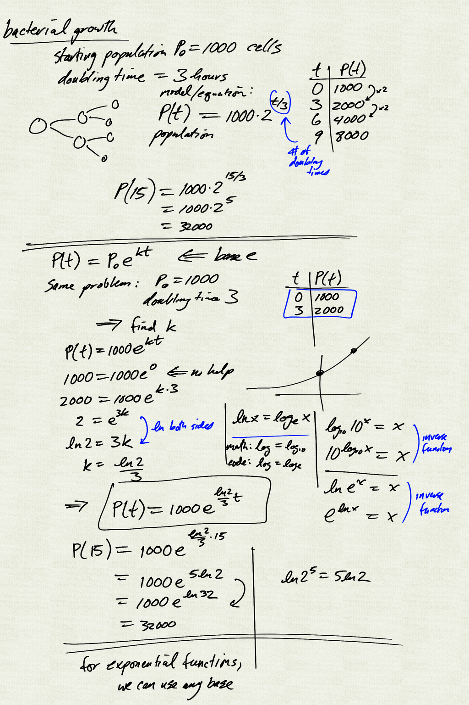
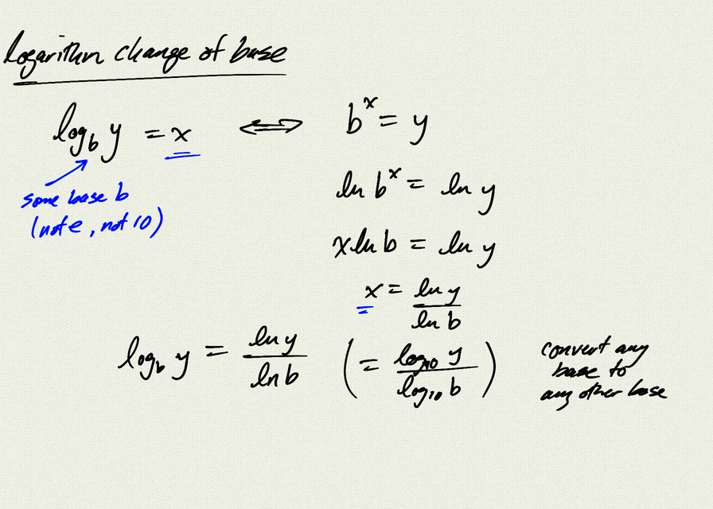

Topics: 
- exponential functions and properties
- logarithmic functions and properties

Application: Radiocarbon dating
- [article about ancient leather armor](https://www.sciencedaily.com/releases/2021/12/211208090026.htm)
- [original leather armor study](https://www.sciencedirect.com/science/article/pii/S1040618221005553)
- [Radiocarbon dating on Wikipedia](https://en.wikipedia.org/wiki/Radiocarbon_dating)

[notes (pdf)](PCHA_7.1_ExponentialLogarithm.pdf)

<iframe width="560" height="315" src="https://www.youtube.com/embed/bxrZMyXvquM" title="YouTube video player" frameborder="0" allow="accelerometer; autoplay; clipboard-write; encrypted-media; gyroscope; picture-in-picture" allowfullscreen></iframe>

