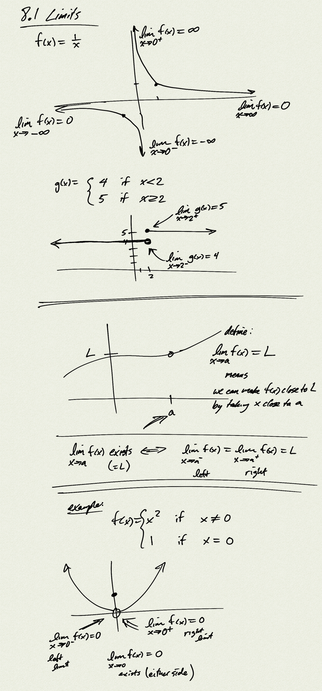
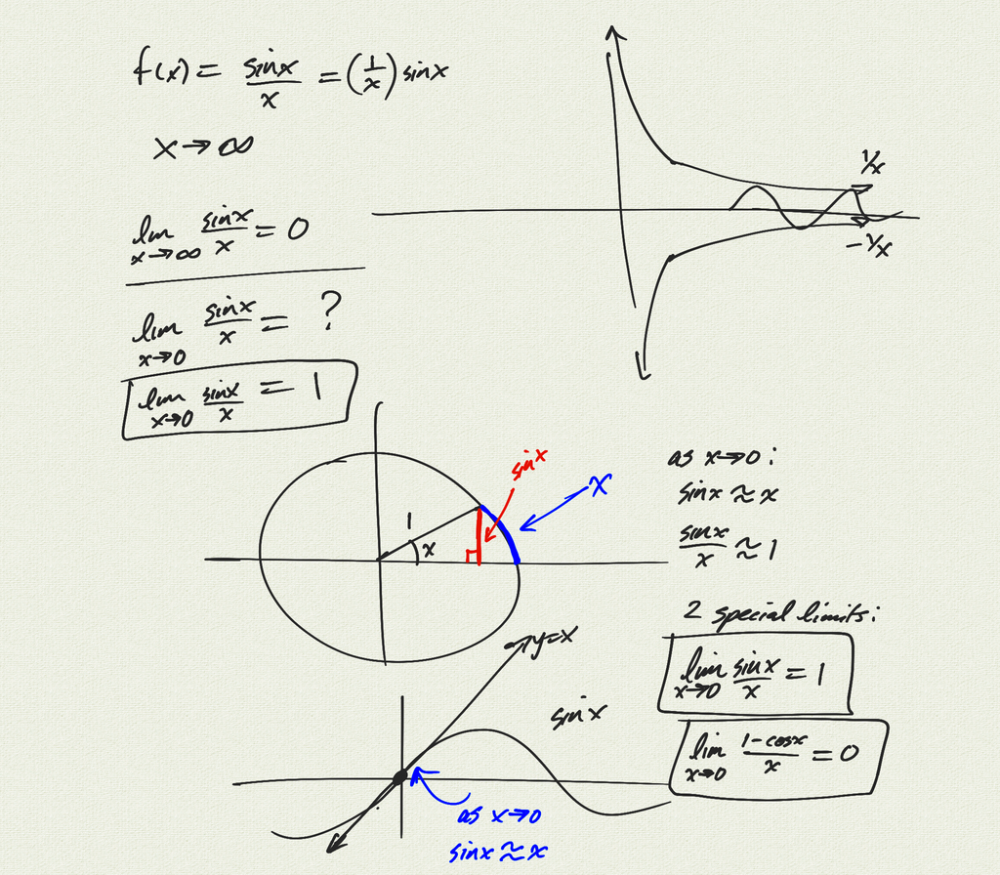

Topics: 
- limits 
- rules for computing limits
- limits of polynomials and rational functions
- Special limits:
    - $\displaystyle \lim_{x\to 0}\frac{\sin x}{x} = 1$
    - $\displaystyle \lim_{x\to 0}\frac{1-\cos x}{x} = 0$

[notes (pdf)](PCHA_8.1_Limits.pdf)

<iframe width="560" height="315" src="https://www.youtube.com/embed/vlkjOXi3zgo" title="YouTube video player" frameborder="0" allow="accelerometer; autoplay; clipboard-write; encrypted-media; gyroscope; picture-in-picture" allowfullscreen></iframe>

