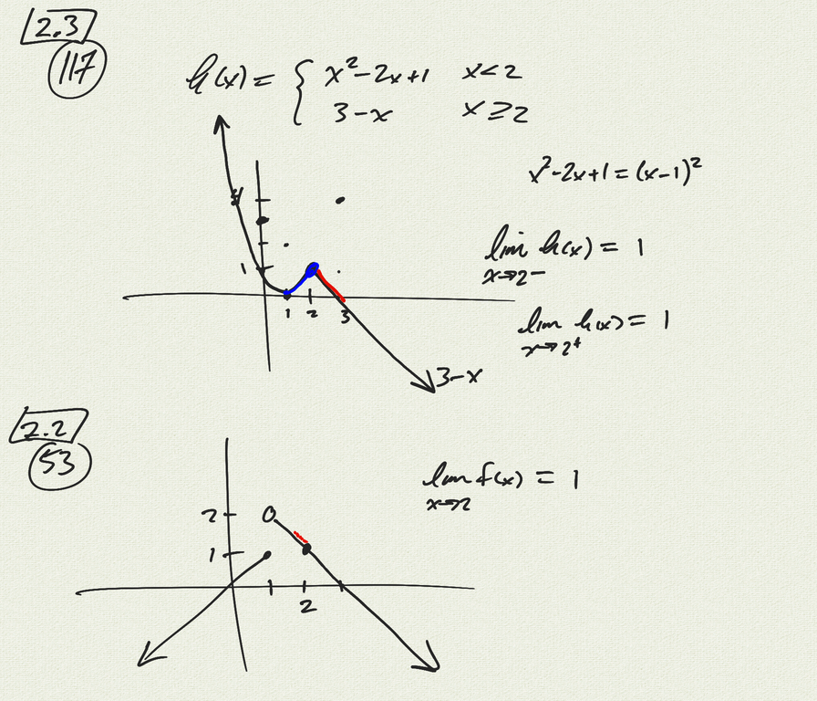
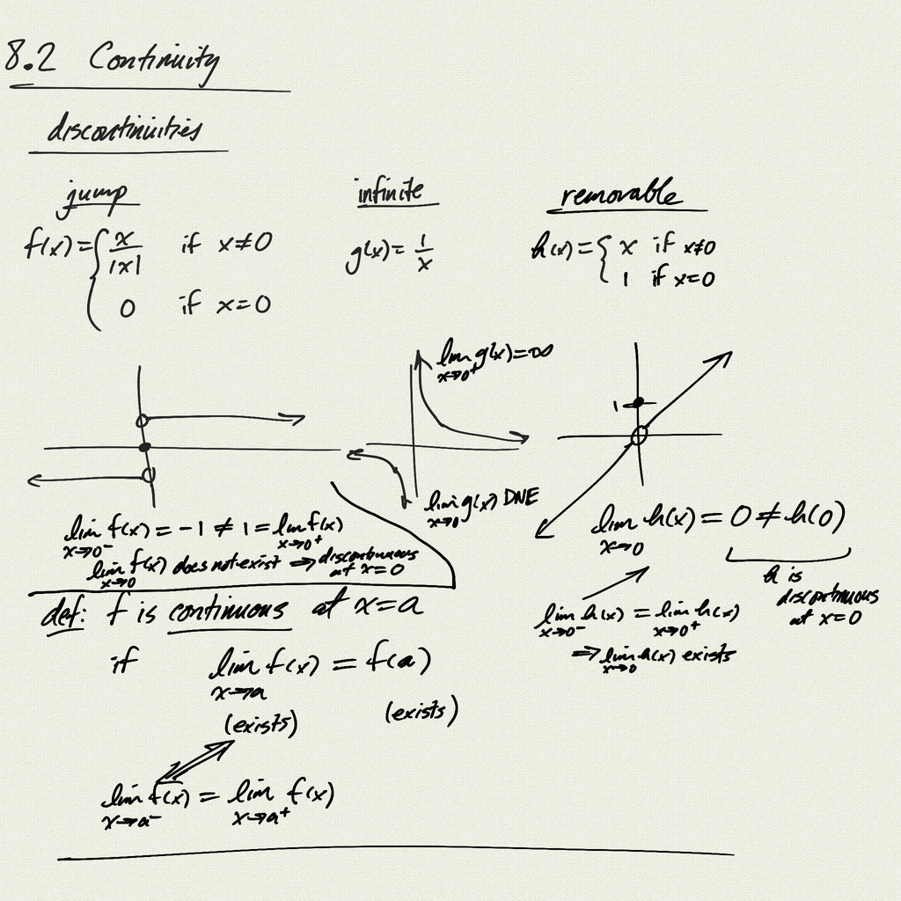
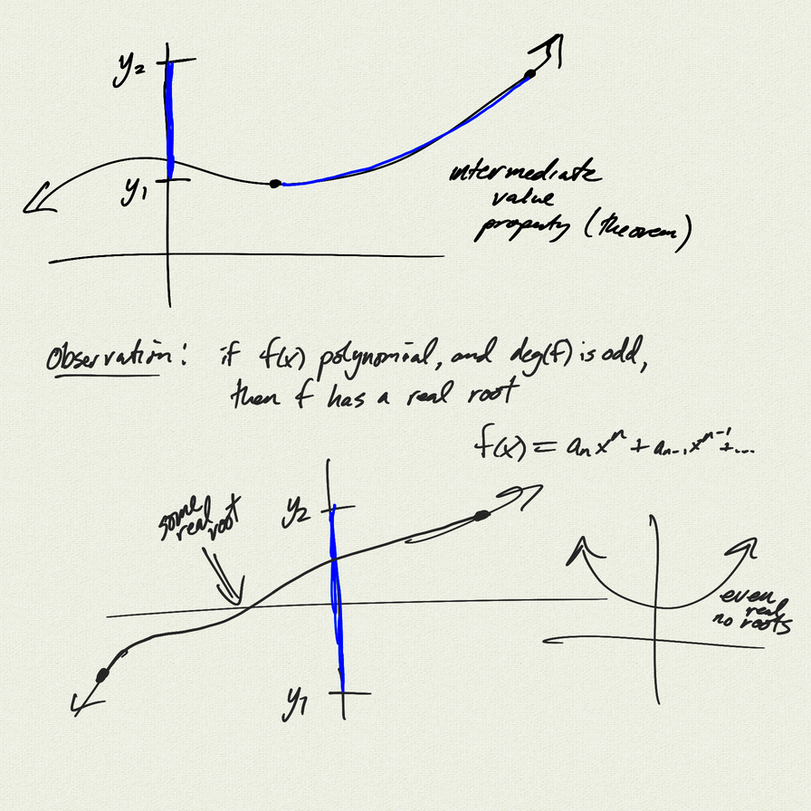
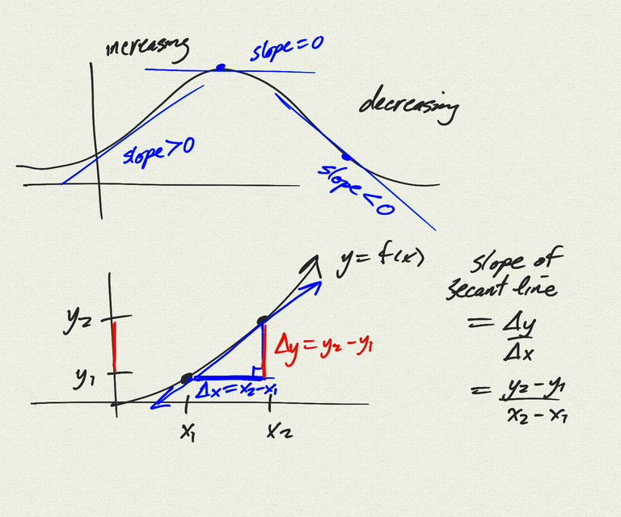

Topics: 
- limit definition of continuity
- intermediate value property of continuous functions
- secant lines

[notes (pdf)](PCHA_8.2_Continuity.pdf)

<iframe width="560" height="315" src="https://www.youtube.com/embed/iZSg_5LoohY" title="YouTube video player" frameborder="0" allow="accelerometer; autoplay; clipboard-write; encrypted-media; gyroscope; picture-in-picture" allowfullscreen></iframe>

