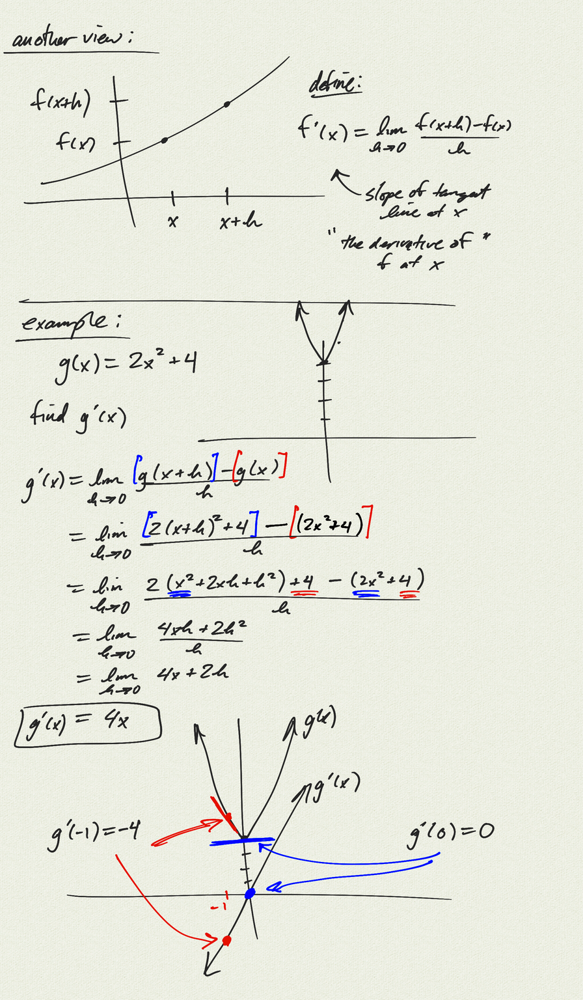

Topics: 

- limit definition of the derivative (slope of tangent line at $x=a$):
    - $\displaystyle f'(a) = \lim_{h\to 0}\dfrac{f(a+h)-f(a)}{h}$  

- alternate definition (slope of tangent line at $x=a$):
    - $\displaystyle f'(a) = \lim_{x\to a}\dfrac{f(x)-f(a)}{x-a}$  

- function definition (derivative as a function):
    - $\displaystyle f'(x) = \lim_{h\to 0}\dfrac{f(x+h)-f(x)}{h}$  

[notes (pdf)](PCHA_8.3_Derivative.pdf)

<iframe width="560" height="315" src="https://www.youtube.com/embed/iLv9YxvGM1c" title="YouTube video player" frameborder="0" allow="accelerometer; autoplay; clipboard-write; encrypted-media; gyroscope; picture-in-picture" allowfullscreen></iframe>

