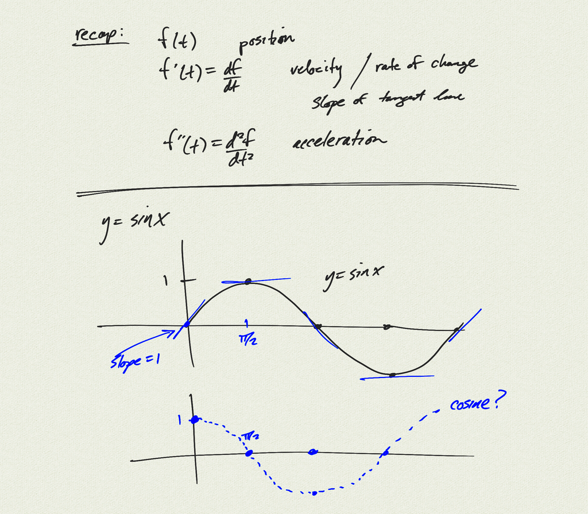

Topics: 

- derivative as rate of change
- position, velocity, acceleration

[notes (pdf)](PCHA_8.5_RatesOfChange.pdf)

<iframe width="560" height="315" src="https://www.youtube.com/embed/JhFrkT9AMX0" title="YouTube video player" frameborder="0" allow="accelerometer; autoplay; clipboard-write; encrypted-media; gyroscope; picture-in-picture" allowfullscreen></iframe>

