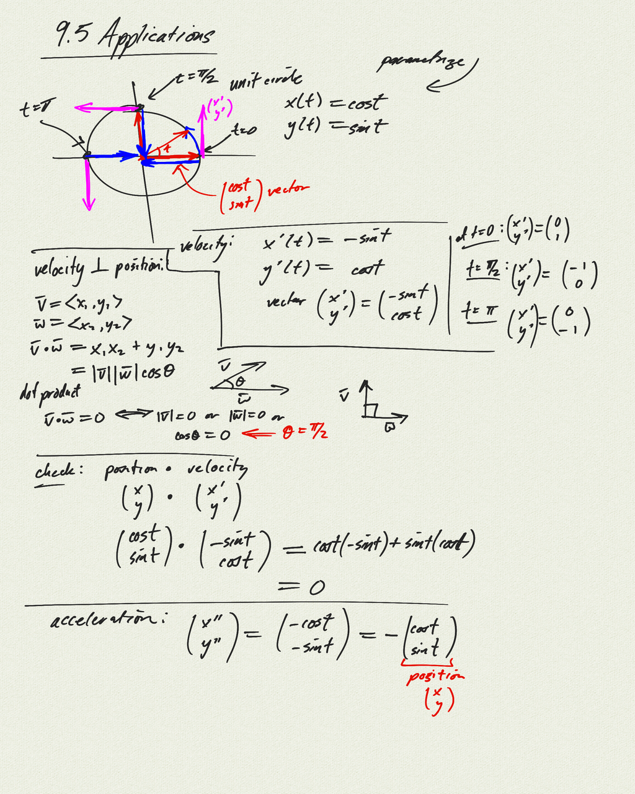
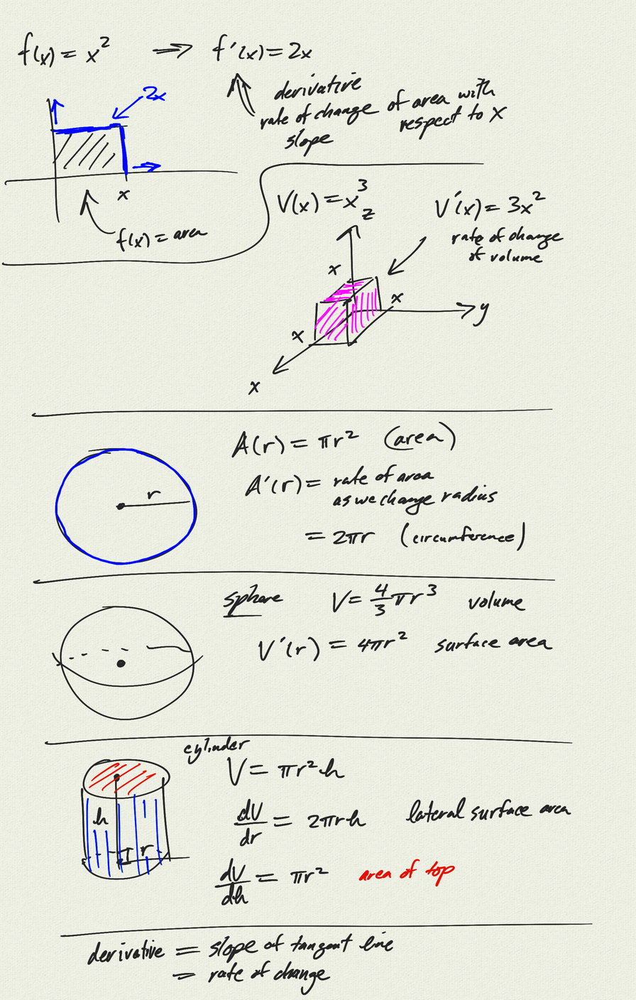

Topics: 

- applications of derivatives:
    - circular motion
    - geometry

[notes (pdf)](PCHA_9.5_Applications.pdf)

<iframe width="560" height="315" src="https://www.youtube.com/embed/NJc-QWH1Wyo" title="YouTube video player" frameborder="0" allow="accelerometer; autoplay; clipboard-write; encrypted-media; gyroscope; picture-in-picture" allowfullscreen></iframe>

