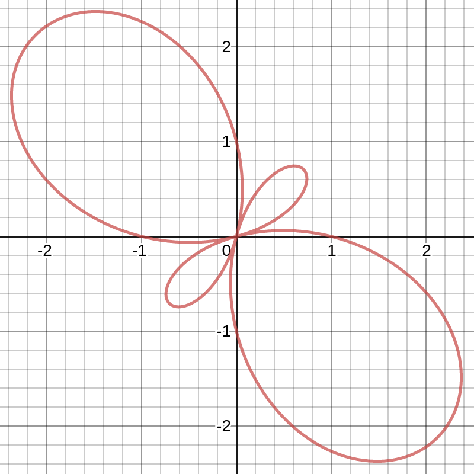

__Unit 3 Group Work__  
__PCHA 2021-22 / Dr. Kessner__  

\vspace{.2in}

__Name / Pledge:__

\vspace{.25in}

__Partner(s):__

\vspace{.2in}

__You can use your notes and/or textbook.  No calculator. Have fun!__

\vspace{.5in}

__1.__ Suppose you have the following vectors:

$$ \vec{u} = \left< 2, 2\sqrt{3} \right> $$
$$ \vec{v} = \left< 3\sqrt{3}, -3 \right> $$
$$ \vec{w} = \left< 3, 0 \right> $$

Calculate the following:
\vspace{.2in}

a) $\lvert \vec{u} \rvert$  
\vspace{.2in}

b) $\lvert \vec{v} \rvert$  
\vspace{.2in}

c) Unit vector in the direction of $\vec{v}$.  
\vspace{.2in}

d) Angle between $\vec{u}$ and $\vec{v}$.  
\vspace{.2in}

g) Angle between $\vec{u}$ and $\vec{w}$.

\newpage

__2.__ a) Parametrize the line segment from $(1, 2)$ to $(3, 6)$.

\vspace{2in}

b) Parametrize the line segment from $(3, 6)$ to $(1, 2)$ (same
points, opposite direction).

\vspace{2in}

c) Parametrize the circle with center $(3, 4)$ and radius 5.

\vspace{2in}

d) Parametrize the same circle, but make the period = 6.

\newpage

__3.__ Find all polar coordinates of the following (rectangular)
points:

a) (1, 1)

\vspace{1in}

b) $(-3\sqrt{3}, 3)$

\vspace{1in}

Convert the following equations from rectangular to polar
coordinates:

c) $3x + 4y = 5$

\vspace{1in}

d) $x^2 + y^2 = 25$

\vspace{1in}

Convert from polar to rectangular:

e) $r = -5\sin\theta$

\vspace{1in}

f) $r = 5\csc\theta$

\newpage

__4.__ Analyze the graph of the polar function $r = 1 - 2\sin 2\theta$:  

1) Find the max $|r|$ values and $\theta$ values where they occur.  
2) State and prove any symmetry relations.  
3) __Challenge:__ What is going on at $\frac{\pi}{4}$ and $\frac{5\pi}{4}$?

{width=30%}

\vspace{2in}

\newpage

__5.__  For each of the following 2x2 matrices, determine whether it is
invertible, and if so, find the inverse matrix and the determinant of the
inverse.  

\vspace{.2in}

$A = 
\begin{pmatrix}
    3 & 0 \\
    0 & 3 \\
\end{pmatrix}$

\vspace{.5in}

$B = 
\begin{pmatrix}
    -2 & 0 \\
    0 & 2 \\
\end{pmatrix}$

\vspace{.5in}

$C = 
\begin{pmatrix}
    0 & 2 \\
    2 & 0 \\
\end{pmatrix}$

\vspace{.5in}

$D = 
\begin{pmatrix}
    1 & 2 \\
    2 & 4 \\
\end{pmatrix}$

\vspace{.5in}

Let $E = \begin{pmatrix}
    6 & 5 \\
    5 & 4 \\
\end{pmatrix}$.  Find $E^{-1}$.  Verify that $E E^{-1} = I$.

\vspace{1in}

Use the inverse matrix you found to solve the following linear systems:

\vspace{.2in}

$\begin{aligned}
6x + 5y &= 1 \\
5x + 4y &= 0
\end{aligned}$

\vspace{.5in}

$\begin{aligned}
6x + 5y &= 0 \\
5x + 4y &= 1
\end{aligned}$

\vspace{.5in}

$\begin{aligned}
6x + 5y &= 1 \\
5x + 4y &= 2
\end{aligned}$

\newpage

__6.__   Consider the following system of linear equations:

$$\begin{aligned}
    x + 3z &= 4 \\
    -x - 2z &= -3  \\
    y - 2z &= -1 \\
\end{aligned}$$

\vspace{.2in}

a. Write the linear system as a matrix equation.
\vspace{1in}

b. Calculate the determinant of the matrix to verify that the matrix is
invertible.  
\vspace{2in}

c. Find the inverse matrix and use it to solve the system.

---
pagetitle: none
geometry: margin=1in
---

